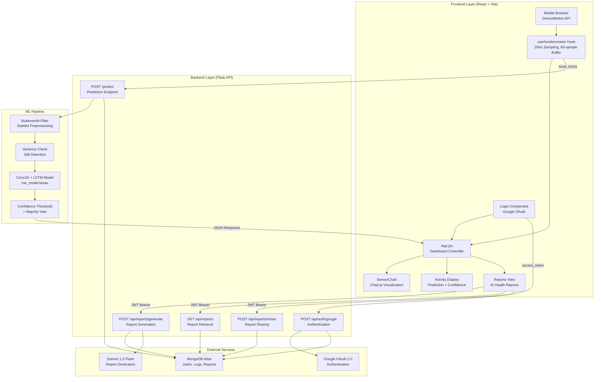
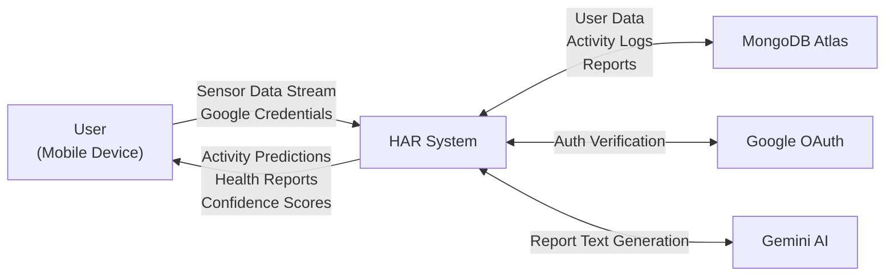
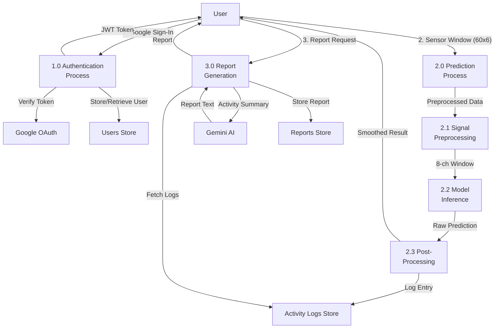
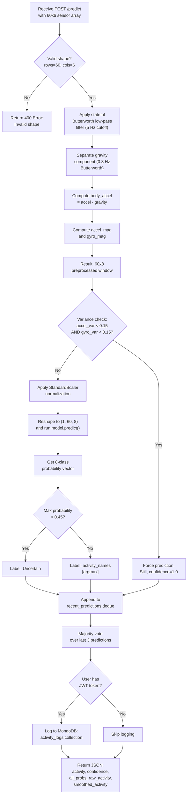
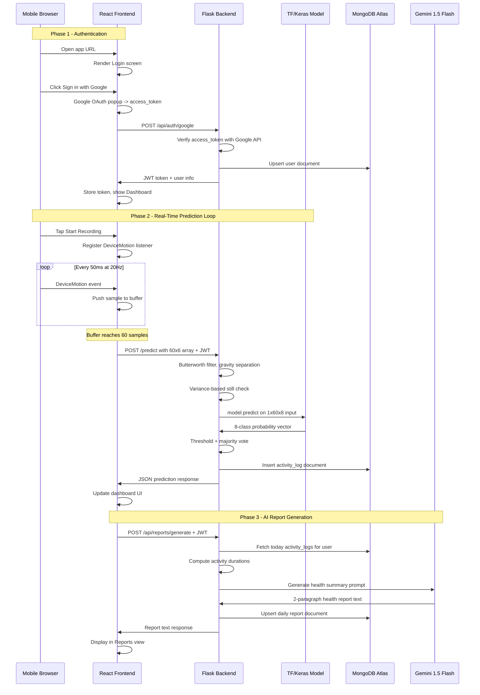
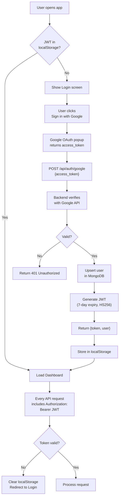

# REAL-TIME HUMAN ACTIVITY RECOGNITION SYSTEM WITH AI-BASED DAILY HEALTH REPORTING

## Minor Project Report

Submitted in partial fulfillment of the requirements for the degree of
Bachelor of Technology in Computer Science and Engineering

**Submitted by:**
Vansh Tambi
Vivek Pasi

**Indian Institute of Information Technology, Bhopal**
2026

---

## ABSTRACT

Human Activity Recognition (HAR) has emerged as a critical area of research in ubiquitous computing, with applications spanning healthcare monitoring, fitness tracking, elderly care, and smart home automation. This project presents the design, development, and deployment of a real-time Human Activity Recognition system capable of classifying eight distinct physical activities using six-axis inertial measurement unit (IMU) data streamed directly from a mobile device's accelerometer and gyroscope sensors. The system employs a hybrid deep learning architecture combining one-dimensional convolutional neural networks (Conv1D) with Long Short-Term Memory (LSTM) networks, enabling both spatial feature extraction across sensor channels and temporal dependency modeling over sliding time windows.

The data pipeline aggregates three established public datasets — WISDM (Wireless Sensor Data Mining), Heterogeneity Activity Recognition, and UCI HAR — alongside custom-recorded mobile sensor data. A custom-priority training strategy is adopted wherein user-recorded data is augmented thirty-fold using six distinct augmentation techniques including Gaussian jitter, magnitude warping, time warping, channel permutation, temporal shifting, and signal inversion, while public dataset contributions are capped at five hundred samples per class. This ensures the model prioritizes real-world mobile sensor characteristics over laboratory-collected data.

The trained model achieves an overall test accuracy of 82.99 percent across seven activity classes: Walking, Jogging, Stairs, Still, Hand Activity, Active Hands, and Sports. Notably, the system achieves 99 percent precision for Jogging, 96 percent precision for and 94 percent precision for Still activities. The inference pipeline incorporates real-time Butterworth signal filtering, variance-based stationary detection, confidence thresholding, and majority voting to deliver stable, low-latency predictions.

The system architecture follows a client-server paradigm with a React-based frontend dashboard built on Vite, a Flask-based REST API backend for model inference and user management, MongoDB Atlas for persistent activity logging, Google OAuth 2.0 for secure authentication, and integration with Google's Gemini 1.5 Flash large language model for automated generation of natural-language daily health reports. The frontend captures sensor data at 20 Hz, buffers sixty samples into three-second sliding windows, and transmits them to the backend for real-time classification with live visualization using Chart.js.

**Keywords:** Human Activity Recognition, Conv1D, LSTM, Deep Learning, Inertial Sensors, Real-Time Classification, Health Monitoring, Sensor Data Augmentation

---

## LIST OF FIGURES

- Figure 1.1: Growth of HAR Research Publications (2015-2025)
- Figure 3.1: High-Level System Architecture
- Figure 3.2: Data Flow Diagram (Level 0)
- Figure 3.3: Data Flow Diagram (Level 1)
- Figure 5.1: Data Preprocessing Pipeline
- Figure 5.2: Conv1D + LSTM Model Architecture
- Figure 5.3: Prediction Pipeline Flowchart
- Figure 5.4: End-to-End System Sequence Diagram
- Figure 5.5: Authentication Flow Diagram
- Figure 6.1: Algorithm Pseudocode — Data Preparation
- Figure 6.2: Algorithm Pseudocode — Real-Time Prediction
- Figure 8.1: Confusion Matrix (8-Class Classification)
- Figure 8.2: Class-Wise Precision, Recall, and F1-Score Comparison
- Figure 8.3: Confidence Distribution Across Activities

## LIST OF TABLES

- Table 2.1: Comparison of HAR Approaches in Literature
- Table 4.1: Dataset Sources and Contributions
- Table 4.2: Activity Class Consolidation Mapping
- Table 4.3: Augmentation Techniques Applied to Custom Data
- Table 7.1: Tools and Technologies Used
- Table 7.2: Python Backend Dependencies
- Table 7.3: Frontend Dependencies
- Table 8.1: Classification Report (Per-Class Metrics)
- Table 8.2: Comparison with Traditional ML Approaches
- Table 8.3: Impact of Augmentation on Model Accuracy

---

## CHAPTER 1: INTRODUCTION

### 1.1 Background

The proliferation of smartphones equipped with high-precision inertial measurement units (IMUs) has created unprecedented opportunities for continuous, non-invasive monitoring of human physical activities. Modern smartphones universally incorporate tri-axial accelerometers and gyroscopes capable of sampling at rates between 20 and 200 Hz, generating rich streams of motion data that encode distinctive patterns corresponding to different physical activities. Human Activity Recognition (HAR) leverages this sensor data to automatically classify user movements, enabling applications in personalized healthcare, rehabilitation monitoring, sports analytics, context-aware computing, and ambient assisted living for elderly populations.

The fundamental challenge in HAR lies in accurately distinguishing between activities that produce similar sensor signatures. For instance, walking and climbing stairs generate comparable accelerometer patterns, while sedentary activities such as sitting and standing produce nearly identical readings during stationary phases. Furthermore, the same activity performed by different individuals exhibits significant inter-subject variability due to differences in gait, body composition, device placement, and movement intensity. These challenges necessitate sophisticated machine learning approaches capable of learning discriminative features from raw or minimally processed sensor data.

Traditional approaches to HAR relied on handcrafted feature engineering, wherein domain experts manually designed statistical and frequency-domain features — such as mean, variance, signal magnitude area, spectral entropy, and autoregressive coefficients — from fixed-size time windows of sensor data. These features were subsequently classified using conventional machine learning algorithms including Support Vector Machines (SVM), Random Forests, k-Nearest Neighbors (k-NN), and Decision Trees. While these methods achieved reasonable accuracy for simple activity sets (walking, sitting, standing), they exhibited limited scalability and poor generalization when confronted with complex, overlapping activities or heterogeneous sensor configurations.

The advent of deep learning has fundamentally transformed the HAR landscape. Convolutional Neural Networks (CNNs) eliminate the need for manual feature engineering by automatically learning hierarchical spatial features directly from raw sensor signals. Recurrent Neural Networks (RNNs), particularly Long Short-Term Memory (LSTM) networks, excel at modeling temporal dependencies inherent in sequential sensor data. Hybrid architectures combining CNNs and LSTMs have demonstrated state-of-the-art performance by jointly extracting spatial features and capturing temporal dynamics within a unified end-to-end framework.

### 1.2 Motivation

Despite significant academic progress in HAR, most existing systems remain confined to offline, batch-processing paradigms evaluated on benchmark datasets under controlled laboratory conditions. The translation of these research prototypes into deployable, real-time systems that operate on commodity hardware with live sensor streams presents numerous engineering challenges that are rarely addressed in academic literature. These challenges include continuous data acquisition at consistent sampling rates, real-time signal preprocessing with minimal latency, efficient model inference within strict time budgets, graceful handling of noisy and incomplete sensor readings, and meaningful presentation of classification results to end users.

Furthermore, the practical utility of activity classification extends beyond mere labeling. Healthcare professionals, fitness coaches, and individuals themselves benefit from aggregated, contextualized summaries of daily activity patterns rather than raw classification outputs. The integration of large language models (LLMs) for automated generation of human-readable health reports from activity logs represents a novel application of generative AI in the HAR domain.

This project is motivated by the objective of bridging the gap between research-grade HAR models and production-ready activity monitoring systems, delivering a complete end-to-end solution encompassing real-time data capture, deep learning inference, persistent data logging, secure authentication, and AI-powered health reporting.

### 1.3 Scope of the Project

This project encompasses the following technical contributions:

1. Design and implementation of a hybrid Conv1D + LSTM deep learning model trained on a custom-priority aggregation of three public HAR datasets and user-recorded mobile sensor data.
2. Development of a real-time signal preprocessing pipeline incorporating Butterworth filtering, gravity separation, and engineered magnitude features.
3. Construction of a responsive React-based dashboard for live sensor data visualization, activity prediction display, and user interaction.
4. Implementation of a Flask-based REST API for model inference, user authentication via Google OAuth 2.0, JWT session management, and MongoDB-backed activity logging.
5. Integration of Google Gemini 1.5 Flash for automated daily health report generation from accumulated activity logs.
6. Deployment infrastructure supporting local area network access for mobile device testing and Vercel-compatible frontend hosting.

### 1.4 Organization of the Report

The remainder of this report is organized as follows. Chapter 2 presents a comprehensive review of existing literature on HAR methodologies. Chapter 3 defines the problem statement and project objectives. Chapter 4 details the proposed methodology including data preparation, model architecture, and system design. Chapter 5 presents the algorithms in pseudocode form. Chapter 6 provides flowcharts and architectural diagrams. Chapter 7 describes the tools and technologies employed along with implementation details. Chapter 8 presents result analysis and discussion. Chapter 9 concludes the report with a summary of contributions and directions for future work.

---

## CHAPTER 2: BACKGROUND DETAILS AND LITERATURE REVIEW

### 2.1 Overview of Human Activity Recognition

Human Activity Recognition is a multidisciplinary research area intersecting signal processing, machine learning, and pervasive computing. The objective is to automatically identify physical activities performed by a user based on data captured from wearable or ambient sensors. HAR systems can be broadly categorized based on their sensing modality: vision-based systems employing cameras and depth sensors, ambient sensor systems utilizing environmental sensors such as pressure mats and door sensors, and wearable sensor systems leveraging accelerometers, gyroscopes, magnetometers, and barometers embedded in smartphones or dedicated wearable devices.

Wearable IMU-based HAR has received the most research attention due to the ubiquity of smartphones, the low cost of MEMS (Micro-Electro-Mechanical Systems) sensors, and the minimal privacy concerns compared to camera-based approaches. The standard pipeline for IMU-based HAR consists of four stages: data collection, signal preprocessing, feature extraction and selection, and classification. The evolution of this pipeline from manual feature engineering to end-to-end deep learning constitutes the primary narrative of HAR research over the past decade.

### 2.2 Traditional Machine Learning Approaches

Early HAR systems relied extensively on handcrafted features extracted from fixed-size sliding windows of sensor data. Anguita et al. [1] introduced the UCI HAR dataset and demonstrated that a multiclass SVM trained on 561 time-domain and frequency-domain features extracted from accelerometer and gyroscope data could achieve 96 percent accuracy on six basic activities (walking, walking upstairs, walking downstairs, sitting, standing, and laying). However, this approach required substantial domain expertise for feature engineering and exhibited limited transferability to novel activity sets or sensor configurations.

Kwapisz et al. [2] utilized the WISDM dataset comprising accelerometer data collected from smartphones carried in users' pockets during six activities. They evaluated multiple classifiers — Decision Trees, Logistic Regression, and Multilayer Perceptrons — on a feature set consisting of mean, standard deviation, absolute deviation, resultant acceleration, time between peaks, and binned distributions. The Multilayer Perceptron achieved the highest accuracy of 91.7 percent on this dataset. Their work highlighted the challenge of inter-subject variability, noting significant performance degradation when models were evaluated on data from unseen users.

Stisen et al. [3] investigated the impact of device heterogeneity on HAR performance using data from nine different smartphone models and two smartwatch models. Their Heterogeneity Activity Recognition dataset demonstrated that models trained on data from one device type often failed to generalize to other devices due to differences in sensor sampling rates, noise characteristics, and coordinate system orientations. This finding underscored the importance of training on heterogeneous data sources for robust real-world deployment.

Random Forests emerged as a popular choice for HAR due to their robustness to overfitting and ability to handle high-dimensional feature spaces. Reyes-Ortiz et al. [4] demonstrated that ensemble methods combining multiple decision tree classifiers achieved competitive accuracy while offering interpretable feature importance rankings that provided insights into which sensor channels and statistical features were most discriminative for activity classification.

### 2.3 Convolutional Neural Network-Based Approaches

The application of Convolutional Neural Networks to sensor-based HAR was pioneered by Yang et al. [5], who proposed applying 1D convolutions directly to raw accelerometer signals, tr the multi-axis sensor data as multi-channel input analogous to color channels in image processing. Their approach eliminated the need for manual feature engineering and achieved accuracy improvements of 3 to 5 percent over traditional methods on the Opportunity and Skoda datasets. The key insight was that convolutional filters learn to detect local patterns such as peaks, valleys, and oscillations in sensor signals that correspond to characteristic motion primitives.

Zeng et al. [6] extended this work by exploring deeper architectures with multiple convolutional layers interspersed with max-pooling operations, demonstrating that hierarchical feature learning — where lower layers capture fine-grained signal patterns and higher layers compose these into activity-level representations — improved classification performance on complex activity taxonomies. Their architecture processed each sensor axis independently through parallel convolutional streams before concatenating the learned features for classification.

Ha and Choi [7] conducted a systematic comparison of CNN architectures for HAR, evaluating single-channel, multi-channel, and cascade architectures on multiple benchmark datasets. Their results indicated that multi-channel architectures processing all sensor axes jointly outperformed single-channel approaches, as inter-axis correlations encode important information about the spatial orientation and dynamics of body movements.

### 2.4 LSTM and Recurrent Network Approaches

Long Short-Term Memory networks address a fundamental limitation of CNNs in the HAR context: the inability to model long-range temporal dependencies that span multiple time steps within a sensor data window. Hammerla et al. [8] conducted a comprehensive benchmark of deep learning architectures for HAR, comparing fully connected networks, CNNs, and vanilla LSTMs across multiple datasets. Their findings indicated that LSTMs consistently outperformed CNNs on datasets with complex temporal structures, particularly for activities involving extended sequences of sub-movements such as cooking or cleaning.

Guan and Plotz [9] proposed attention-based LSTM architectures for HAR, introducing a mechanism that allowed the network to selectively focus on the most informative time steps within a window rather than tr all time steps equally. This attention mechanism improved accuracy on the PAMAP2 and Opportunity datasets while providing interpretable visualizations of which temporal segments the model deemed most relevant for classification.

Bidirectional LSTMs, which process input sequences in both forward and reverse directions, were shown by Zhao et al. [10] to capture richer temporal context by leveraging both past and future information within a window. This architecture achieved improved recognition of transition activities — such as sit-to-stand or stand-to-walk — where the temporal context surrounding the transition point is critical for accurate classification.

### 2.5 Hybrid CNN-LSTM Architectures

The complementary strengths of CNNs (spatial feature extraction) and LSTMs (temporal dependency modeling) motivated the development of hybrid architectures that combine both approaches. Ordonez and Roggen [11] proposed DeepConvLSTM, a seminal architecture consisting of four convolutional layers followed by two LSTM layers. The convolutional layers extract local features from short temporal segments, while the LSTM layers model the temporal evolution of these features across the entire window. DeepConvLSTM achieved state-of-the-art results on the Opportunity and Skoda datasets, establishing the CNN-LSTM paradigm as the dominant approach in HAR research.

The theoretical motivation for the hybrid approach rests on the observation that human activities are inherently hierarchical: low-level motion primitives (e.g., individual foot strikes during walking) compose into higher-level temporal patterns (e.g., the rhythmic gait cycle) that collectively characterize an activity. CNNs are well-suited to detecting the low-level primitives through local receptive fields, while LSTMs excel at capturing the higher-level compositional structure through their recurrent memory mechanism.

Subsequent works refined the hybrid paradigm. Mutegeki and Han [12] introduced batch normalization between convolutional layers to stabilize training and improve generalization. Xia et al. [13] explored deeper convolutional encoders with residual connections to facilitate gradient flow in very deep networks. Chen et al. [14] combined the hybrid architecture with multi-task learning, simultaneously predicting the activity class and estimating physical parameters such as walking speed and energy expenditure.

### 2.6 Data Augmentation for Sensor Data

Data augmentation, a technique well-established in computer vision, has been adapted for sensor-based HAR to address the chronic problem of limited labeled training data. Um et al. [15] systematically evaluated augmentation techniques for IMU data, including rotation, permutation, time warping, magnitude warping, jittering, and scaling. Their findings indicated that combining multiple augmentation strategies yielded more robust models than any single technique, with time warping and jittering providing the most consistent improvements across datasets.

### 2.7 Summary and Research Gap

Table 2.1 summarizes the key approaches reviewed in this chapter.

**Table 2.1: Comparison of HAR Approaches in Literature**

| Approach | Representative Work | Strengths | Limitations |
|----------|-------------------|-----------|-------------|
| SVM + Handcrafted Features | Anguita et al. [1] | High accuracy on simple activities; interpretable features | Requires domain expertise; poor scalability |
| Random Forest | Reyes-Ortiz et al. [4] | Robust to overfitting; feature importance | Limited to engineered features |
| 1D CNN | Yang et al. [5] | Automatic feature learning; no manual engineering | Limited temporal modeling |
| LSTM | Hammerla et al. [8] | Strong temporal dependency modeling | Computationally expensive; limited spatial features |
| DeepConvLSTM | Ordonez and Roggen [11] | Joint spatial-temporal learning; state-of-the-art | High parameter count; offline evaluation only |
| Attention-LSTM | Guan and Plotz [9] | Interpretable; selective temporal focus | Complex architecture |

The literature reveals that while hybrid CNN-LSTM architectures represent the state of the art, most studies evaluate models exclusively on pre-segmented benchmark datasets in offline settings. Critical aspects of real-world deployment — including real-time sensor streaming, signal preprocessing for live data, confidence-aware prediction, user authentication, persistent activity logging, and automated health reporting — remain largely unaddressed. This project bridges this gap by delivering a complete, deployable HAR system that integrates a custom-trained Conv1D + LSTM model with a production-grade software stack.

---

## CHAPTER 3: PROBLEM DEFINITION AND OBJECTIVES

### 3.1 Problem Statement

Existing Human Activity Recognition systems suffer from several limitations that impede their practical deployment:

1. **Dependence on single-modality sensor data.** Many systems utilize only accelerometer data, neglecting the complementary information provided by gyroscope sensors regarding rotational dynamics and angular velocity, which are critical for disambiguating activities with similar translational motion profiles.

2. **Reliance on controlled laboratory datasets.** Models trained exclusively on benchmark datasets collected under controlled conditions exhibit significant performance degradation when deployed in unconstrained real-world environments characterized by diverse device models, variable sensor placement, and ambient noise.

3. **Absence of real-time inference infrastructure.** The majority of HAR research evaluates models in offline, batch-processing settings, neglecting the engineering challenges of continuous sensor data streaming, real-time preprocessing, and low-latency inference required for responsive user-facing applications.

4. **Lack of actionable health insights.** Raw activity classification labels provide limited value to end users without contextual aggregation, temporal analysis, and human-readable interpretation of daily activity patterns.

### 3.2 Objectives

The primary objectives of this project are:

1. To design and train a hybrid Conv1D + LSTM deep learning model for eight-class human activity recognition using six-axis IMU data (accelerometer and gyroscope), achieving a minimum test accuracy of 80 percent.

2. To develop a custom-priority data preparation pipeline that aggregates multiple public datasets (WISDM, Heterogeneity, UCI HAR) with user-recorded mobile sensor data, employing aggressive data augmentation to ensure model alignment with real-world sensor characteristics.

3. To implement a real-time prediction pipeline incorporating Butterworth signal filtering, variance-based stationary detection, confidence thresholding, and temporal smoothing via majority voting.

4. To build a responsive web-based dashboard enabling live sensor data capture from mobile browsers at 20 Hz, real-time activity visualization, and prediction display with confidence indicators.

5. To implement secure user authentication using Google OAuth 2.0 with JWT-based session management, and persistent activity logging using MongoDB Atlas.

6. To integrate Google Gemini 1.5 Flash for automated generation of daily health reports from accumulated activity logs, with support for report sharing between users.
## CHAPTER 4: PROPOSED METHODOLOGY AND WORK DESCRIPTION

### 4.1 System Overview

The proposed system follows a client-server architecture comprising four principal subsystems: (a) a mobile sensor data acquisition layer, (b) a deep learning inference engine, (c) a persistent data management layer, and (d) an AI-powered reporting module. The mobile browser captures raw accelerometer and gyroscope data using the W3C DeviceMotion API, buffers sixty samples at 20 Hz to form three-second sliding windows, and transmits each window as a JSON payload to the Flask backend via HTTP POST requests. The backend applies real-time signal preprocessing, invokes the trained Conv1D + LSTM model for inference, logs predictions to MongoDB, and returns classification results to the frontend for live visualization.

### 4.2 Data Collection and Dataset Aggregation

The training data is assembled from four sources, each contributing unique characteristics to the overall dataset.

**Table 4.1: Dataset Sources and Contributions**

| Dataset | Source | Sensor Modalities | Raw Activities | Samples Used |
|---------|--------|-------------------|---------------|-------------|
| WISDM | UCI Archive | Phone Accel + Gyro | 18 coded (A-S) | Capped 500/class |
| Heterogeneity | UCI Archive | Phone Accel + Gyro | 6 activities | Capped 500/class |
| UCI HAR | UCI Archive | Body Accel + Gyro | 6 activities (1-6) | Capped 500/class |
| Custom CSV | User-recorded | Phone Accel + Gyro | 3 activities | Uncapped, 30x augmented |

The WISDM dataset provides accelerometer and gyroscope readings from smartphone sensors carried by subjects performing eighteen activities including walking, jogging, stairs, sitting, standing (various types), and sports activities. Each record contains a subject identifier, activity code, timestamp, and tri-axial sensor values. The data is stored in semicolon-delimited text files requiring custom parsing logic to handle malformed entries and missing values.

The Heterogeneity Activity Recognition dataset addresses device heterogeneity by collecting data from multiple smartphone models. It contains accelerometer and gyroscope readings for six activities: walk, sit, stand, stairs up, stairs down, and bike. The data is distributed as a ZIP archive containing CSV files with columns for timestamp, user, device model, sensor values, and ground truth labels. Due to its large size, aggressive subsampling (every tenth row) is applied during extraction to manage memory constraints.

The UCI HAR dataset provides pre-segmented windows of 128 samples from body-mounted accelerometers and gyroscopes during six activities. Since the window length differs from the project's standard of sixty samples, bilinear interpolation via scipy.ndimage.zoom is applied to resample each 128-sample window to sixty samples while preserving the signal morphology.

Custom mobile sensor data was recorded by the project team using a smartphone sensor logging application. Three CSV files were recorded for Still, Jogging, and activities, each containing timestamped accelerometer (sensor type 1) and gyroscope (sensor type 4) readings. The custom data undergoes timestamp-based alignment using pandas merge_asof with nearest-neighbor matching and a tolerance of 500 milliseconds.

### 4.3 Activity Class Consolidation

The heterogeneous activity taxonomies across datasets are unified into eight consolidated classes through a carefully designed mapping.

**Table 4.2: Activity Class Consolidation Mapping**

| Unified Class | WISDM Codes | Heterogeneity Labels | UCI HAR Labels |
|--------------|-------------|---------------------|---------------|
| Walking | A | walk | 1 |
| Jogging | B | — | — |
| Stairs | C | stairsup, stairsdown | 2, 3 |
| Still | D, E | sit, stand | 4, 5, 6 |
| | H, I, J, K, L | — | — |
| Hand Activity | F, G, Q | — | — |
| Active Hands | R, S | — | — |
| Sports | M, O, P | bike | — |

This consolidation groups semantically similar activities to reduce class fragmentation and improve model stability. For example, WISDM codes D (sitting) and E (standing) are merged into "Still" since both represent stationary postures with minimal sensor variance. Multiple sub-activities (drinking soup sandwich chips pasta) are consolidated into a single "" class to provide sufficient training samples for this complex activity category.

### 4.4 Signal Preprocessing Pipeline

Each raw sensor window undergoes a multi-stage preprocessing pipeline that transforms the six-channel input (accelerometer XYZ, gyroscope XYZ) into an eight-channel representation optimized for deep learning classification.

**Stage 1: Noise Reduction.**
A third-order Butterworth low-pass filter with a cutoff frequency of 5 Hz (relative to the 20 Hz sampling rate) is applied independently to each of the six sensor channels. This filter attenuates high-frequency noise introduced by sensor quantization, mechanical vibrations, and electromagnetic interference while preserving the low-frequency motion components that encode activity information. The filter is designed using scipy.signal.butter with second-order sections (SOS) representation for numerical stability.

**Stage 2: Gravity Separation.**
A second third-order Butterworth low-pass filter with a much lower cutoff frequency of 0.3 Hz is applied to the three accelerometer channels to isolate the gravitational component. Since gravity manifests as a quasi-static acceleration vector aligned with the Earth's gravitational field, it occupies the lowest frequency band of the accelerometer signal. The body acceleration component is obtained by subtracting the estimated gravity from the filtered accelerometer signal: body_accel = filtered_accel - gravity.

**Stage 3: Magnitude Feature Engineering.**
Two additional channels are computed: the Euclidean magnitude of the body acceleration vector (accel_mag = sqrt(bx^2 + by^2 + bz^2)) and the Euclidean magnitude of the gyroscope vector (gyro_mag = sqrt(gx^2 + gy^2 + gz^2)). These magnitude features provide rotation-invariant representations of motion intensity that are independent of the device's spatial orientation relative to the user's body.

**Stage 4: Output.**
The final preprocessed window has shape (60, 8) with channels: [body_accel_x, body_accel_y, body_accel_z, gyro_x, gyro_y, gyro_z, accel_magnitude, gyro_magnitude].

### 4.5 Data Augmentation Strategy

Custom-recorded data receives thirty-fold augmentation using six complementary techniques applied in combination to each original window:

**Table 4.3: Augmentation Techniques Applied to Custom Data**

| Technique | Description | Parameters | Application Frequency |
|-----------|-------------|------------|----------------------|
| Gaussian Jitter | Additive white Gaussian noise | sigma in [0.01, 0.05] | Every sample |
| Magnitude Scaling | Multiplicative scaling factor | scale in [0.90, 1.10] | Every sample |
| Temporal Shifting | Circular shift along time axis | shift in [0, 8] samples | Every sample |
| Time Warping | Non-uniform temporal distortion | warp in [0.8, 1.2] | Every 3rd sample |
| Channel Permutation | Random reordering of axis channels | Random permutation of 3 axes | Every 5th sample |
| Signal Inversion | Sign reversal on random channel | Single channel negated | Every 4th sample |

The augmentation pipeline produces diverse training examples that simulate natural variations in sensor readings caused by differences in device placement, user biomechanics, and environmental conditions. The combination of multiple techniques ensures that the model learns features invariant to these sources of variability rather than overfitting to the specific characteristics of the recorded data.

Public dataset contributions are capped at five hundred windows per class using random sampling. This cap prevents large public datasets from dominating the training distribution and ensures that the model's learned representations are biased toward the custom data's sensor characteristics, which more closely match the deployment environment.

### 4.6 Model Architecture

The classification model employs a sequential hybrid architecture consisting of two convolutional feature extraction blocks, two LSTM temporal modeling layers, and a fully connected classifier head.

**Feature Extraction Block 1:**
- Conv1D with 64 filters, kernel size 5, ReLU activation, same padding, L2 regularization (lambda = 1e-4)
- Batch Normalization
- Conv1D with 64 filters, kernel size 3, ReLU activation, same padding, L2 regularization
- Batch Normalization
- MaxPooling1D with pool size 2 (reduces temporal dimension from 60 to 30)
- Dropout with rate 0.2

The first block employs a larger initial kernel (size 5) to capture broader temporal patterns spanning 250 milliseconds of sensor data, followed by a smaller kernel (size 3) for fine-grained refinement. Batch normalization stabilizes training by normalizing intermediate activations, while max-pooling reduces the temporal resolution and introduces translational invariance.

**Feature Extraction Block 2:**
- Conv1D with 128 filters, kernel size 3, ReLU activation, same padding, L2 regularization
- Batch Normalization
- Conv1D with 128 filters, kernel size 3, ReLU activation, same padding, L2 regularization
- Batch Normalization
- MaxPooling1D with pool size 2 (reduces temporal dimension from 30 to 15)
- Dropout with rate 0.3

The second block doubles the filter count to learn richer, more abstract feature representations at the reduced temporal resolution. The increased dropout rate mitigates overfitting as the network depth increases.

**Temporal Modeling:**
- LSTM with 128 units, return_sequences=True, L2 regularization
- Dropout with rate 0.3
- LSTM with 64 units, return_sequences=False, L2 regularization
- Dropout with rate 0.4

The first LSTM processes the sequence of convolutional feature vectors (15 time steps of 128-dimensional features) and outputs a sequence of hidden states, capturing temporal dependencies across the reduced window. The second LSTM condenses this sequence into a single fixed-dimensional vector representing the temporal summary of the entire window. The stacked LSTM configuration enables hierarchical temporal abstraction.

**Classifier Head:**
- Dense with 128 units, ReLU activation, L2 regularization
- Batch Normalization, Dropout 0.4
- Dense with 64 units, ReLU activation, L2 regularization
- Batch Normalization, Dropout 0.3
- Dense with 8 units, Softmax activation (output layer)

The classifier maps the LSTM output to an eight-dimensional probability distribution over activity classes using the softmax activation function. Progressive dimensionality reduction (128 → 64 → 8) with dropout prevents overfitting in the classification layers.

### 4.7 Training Configuration

The model is trained using the following configuration:

- **Optimizer:** Adam with initial learning rate 0.001
- **Loss Function:** Sparse categorical cross-entropy
- **Batch Size:** 64
- **Maximum Epochs:** 60
- **Early Stopping:** Monitors validation accuracy with patience of 10 epochs, restores best weights
- **Learning Rate Scheduling:** ReduceLROnPlateau monitors validation loss, reduces by factor 0.5 with patience 3, minimum 1e-6
- **Class Weighting:** Computed using sklearn's compute_class_weight with 'balanced' strategy to compensate for class imbalance
- **Data Split:** 80 percent training, 20 percent testing, stratified by class label

Input data is normalized using sklearn's StandardScaler fitted on the flattened training data. The scaler parameters are persisted as a pickle file for consistent normalization during inference.

### 4.8 Real-Time Inference Pipeline

The inference pipeline incorporates multiple stages of intelligence beyond raw model prediction:

1. **Stateful Butterworth Filtering:** Unlike training-time preprocessing which uses zero-phase bidirectional filtering (sosfiltfilt), real-time inference uses causal filtering (sosfilt) with persistent filter states maintained across consecutive prediction requests. This ensures smooth, continuous filtering of the streaming sensor data without introducing look-ahead artifacts.

2. **Variance-Based Stationary Detection:** Before invoking the neural network, the system computes the sum of per-axis variances for both accelerometer and gyroscope channels. If both variances fall below 0.15, the system bypasses model inference entirely and returns "Still" with 100 percent confidence. This heuristic eliminates false positive activity classifications when the device is placed on a stationary surface.

3. **StandardScaler Normalization:** The preprocessed eight-channel window is normalized using the training-time scaler to ensure consistent input distributions.

4. **Model Inference:** The normalized window is reshaped to (1, 60, 8) and passed through the Keras model to obtain an eight-dimensional probability vector.

5. **Confidence Thresholding:** If the maximum class probability falls below 0.45, the prediction is labeled as "Uncertain" rather than committing to a potentially incorrect classification.

6. **Majority Voting:** A sliding window of the three most recent predictions is maintained, and the final output is determined by majority vote to smooth temporal fluctuations in predictions.

### 4.9 Authentication and Data Persistence

User authentication employs the OAuth 2.0 implicit grant flow via Google's authentication service. The frontend uses the @react-oauth/google library to initiate the Google Sign-In flow, obtaining an access token upon successful authentication. This access token is transmitted to the backend, which verifies it by querying Google's userinfo endpoint (googleapis.com/oauth2/v3/userinfo) to retrieve the user's email address and display name.

Upon successful verification, the backend creates or retrieves the user record in MongoDB and issues a JSON Web Token (JWT) with a seven-day expiry, signed using the HS256 algorithm with a server-side secret. Subsequent API requests include this JWT in the Authorization header as a Bearer token, enabling stateless session management.

Activity predictions made by authenticated users are logged to MongoDB's activity_logs collection with fields for user_id, timestamp, activity label, and confidence score. This accumulated data serves as the input for AI-powered health report generation.

### 4.10 AI-Powered Health Reporting

The health reporting module aggregates a user's daily activity logs, computes activity durations (estimated as prediction count multiplied by three seconds per window), and constructs a structured prompt for Google's Gemini 1.5 Flash model. The prompt instructs the LLM to generate a professional, encouraging, two-paragraph daily health report summarizing the user's movement patterns without exposing raw numerical data.

Generated reports are stored in MongoDB's reports collection with one report per user per day (upsert semantics). Users can share reports with other registered users by email, enabling collaborative health monitoring scenarios such as caregiver-patient or coach-athlete relationships.

---

## CHAPTER 5: PROPOSED ALGORITHMS

### 5.1 Algorithm 1: Data Preparation Pipeline

```
ALGORITHM: Prepare_HAR_Training_Data

INPUT: Custom CSV files, WISDM dataset, Heterogeneity dataset, UCI HAR dataset
OUTPUT: X_all.npy (N x 60 x 8), y_all.npy (N,)

BEGIN
    DEFINE WINDOW_SIZE = 60, STEP_SIZE = 30, CHANNELS = 8
    DEFINE ACTIVITY_MERGE mapping for all datasets
    INITIALIZE frames = [], labels = []

    // Phase 1: Extract and augment custom data (highest priority)
    FOR EACH (csv_file, activity_label) IN custom_files:
        df = READ csv_file
        accel = FILTER rows WHERE sensor_type == 1
        gyro = FILTER rows WHERE sensor_type == 4
        merged = MERGE_ASOF(accel, gyro, on='Timestamp', tolerance=500ms)
        data_6ch = merged[ax, ay, az, gx, gy, gz]

        FOR i = 0 TO len(data_6ch) - WINDOW_SIZE STEP STEP_SIZE:
            window = data_6ch[i : i + WINDOW_SIZE]
            processed = PREPROCESS_WINDOW(window)  // 6ch -> 8ch
            frames.APPEND(processed)
            labels.APPEND(activity_label)
        END FOR

        // 30x augmentation on custom data
        aug_frames = AUGMENT(frames_from_this_file, num_augments=30)
        frames.EXTEND(aug_frames)
    END FOR

    // Phase 2-4: Extract public datasets (capped at 500/class)
    FOR EACH dataset IN [UCI_HAR, Heterogeneity, WISDM]:
        ds_frames, ds_labels = EXTRACT(dataset)
        ds_frames, ds_labels = CAP_PER_CLASS(ds_frames, ds_labels, max=500)
        frames.EXTEND(ds_frames)
        labels.EXTEND(ds_labels)
    END FOR

    X_all = NUMPY_ARRAY(frames)
    y_all = NUMPY_ARRAY(labels)
    SAVE(X_all, "X_all.npy")
    SAVE(y_all, "y_all.npy")
END

FUNCTION PREPROCESS_WINDOW(window_6d):
    // window_6d shape: (N, 6)
    filtered = BUTTERWORTH_LOWPASS(window_6d, cutoff=5Hz, order=3)
    accel = filtered[:, 0:3]
    gyro = filtered[:, 3:6]
    gravity = BUTTERWORTH_LOWPASS(accel, cutoff=0.3Hz, order=3)
    body_accel = accel - gravity
    accel_mag = NORM(body_accel, axis=1)
    gyro_mag = NORM(gyro, axis=1)
    RETURN CONCATENATE(body_accel, gyro, accel_mag, gyro_mag)
    // Output shape: (N, 8)
END FUNCTION
```

**Figure 6.1: Pseudocode for Data Preparation Algorithm**

### 5.2 Algorithm 2: Real-Time Prediction

```
ALGORITHM: Real_Time_HAR_Prediction

INPUT: sensor_window (60 x 6 raw sensor data), filter_states, recent_predictions
OUTPUT: smoothed_activity, confidence, probability_vector

BEGIN
    // Step 1: Validate input
    IF shape(sensor_window) != (60, 6):
        RETURN ERROR "Invalid input shape"

    // Step 2: Real-time preprocessing (causal filtering)
    FOR i = 0 TO 5:
        filtered[:, i], filter_states[i] = SOSFILT(sos_noise, sensor_window[:, i], zi=filter_states[i])
    END FOR
    accel = filtered[:, 0:3]
    gyro = filtered[:, 3:6]

    FOR i = 0 TO 2:
        gravity[:, i], gravity_states[i] = SOSFILT(sos_gravity, accel[:, i], zi=gravity_states[i])
    END FOR
    body_accel = accel - gravity
    accel_mag = NORM(body_accel, axis=1)
    gyro_mag = NORM(gyro, axis=1)
    processed = CONCATENATE(body_accel, gyro, accel_mag, gyro_mag)  // (60, 8)

    // Step 3: Stationary detection (bypass model)
    accel_variance = SUM(VARIANCE(sensor_window[:, 0:3], axis=0))
    gyro_variance = SUM(VARIANCE(sensor_window[:, 3:6], axis=0))
    IF accel_variance < 0.15 AND gyro_variance < 0.15:
        RETURN ("Still", 1.0, [0,...,1,...,0])

    // Step 4: Normalize and predict
    processed_scaled = SCALER.TRANSFORM(processed)
    X = RESHAPE(processed_scaled, (1, 60, 8))
    probabilities = MODEL.PREDICT(X)
    pred_index = ARGMAX(probabilities)
    confidence = probabilities[pred_index]
    activity = ACTIVITY_NAMES[pred_index]

    // Step 5: Confidence thresholding
    IF confidence < 0.45:
        activity = "Uncertain"

    // Step 6: Majority voting (temporal smoothing)
    recent_predictions.APPEND(activity)
    smoothed_activity = MODE(recent_predictions, last_3)

    RETURN (smoothed_activity, confidence, probabilities)
END
```

**Figure 6.2: Pseudocode for Real-Time Prediction Algorithm**

---

## CHAPTER 6: PROPOSED FLOWCHARTS AND DIAGRAMS

### 6.1 System Architecture Diagram

**Figure 3.1: High-Level System Architecture**



### 6.2 Data Flow Diagram (Level 0)

**Figure 3.2: Context-Level Data Flow Diagram**



### 6.3 Data Flow Diagram (Level 1)

**Figure 3.3: Detailed Data Flow Diagram**



### 6.4 Prediction Pipeline Flowchart

**Figure 5.3: Prediction Pipeline Flowchart**



### 6.5 End-to-End Sequence Diagram

**Figure 5.4: End-to-End System Sequence Diagram**



### 6.6 Authentication Flow Diagram

**Figure 5.5: Authentication and Session Flow**


## CHAPTER 7: IMPLEMENTATION (TOOLS AND TECHNOLOGY USED)

### 7.1 Overview of Technology Stack

The system is implemented as a full-stack web application with clearly delineated frontend, backend, machine learning, and data infrastructure layers. Each technology was selected based on specific technical requirements including real-time performance, cross-platform compatibility, scalability, and developer productivity.

**Table 7.1: Tools and Technologies Used**

| Layer | Technology | Version | Justification |
|-------|-----------|---------|---------------|
| Frontend Framework | React | 19.2.5 | Component-based architecture; efficient re-rendering for real-time data |
| Build Tool | Vite | 8.0.9 | Fast HMR; native ES module support; LAN hosting via --host |
| Charting | Chart.js + react-chartjs-2 | 4.5.1 / 5.3.1 | Canvas-based rendering for high-frequency sensor data visualization |
| Animation | Framer Motion | 12.38.0 | Declarative animation API for smooth UI transitions |
| Icons | Lucide React | 1.8.0 | Lightweight, tree-shakeable SVG icon library |
| HTTP Client | Axios | 1.15.1 | Promise-based HTTP with interceptor support |
| Authentication | @react-oauth/google | 0.13.5 | Google OAuth 2.0 implicit grant flow for React |
| Backend Framework | Flask | Latest | Lightweight WSGI framework; suitable for ML model serving |
| CORS | Flask-CORS | Latest | Cross-origin resource sharing for frontend-backend communication |
| ML Framework | TensorFlow / Keras | Latest | Industry-standard deep learning; Keras Sequential API |
| Signal Processing | SciPy | Latest | Butterworth filter design and application |
| Data Processing | NumPy, Pandas | Latest | Efficient numerical computation and tabular data manipulation |
| Preprocessing | scikit-learn | Latest | StandardScaler, LabelEncoder, train_test_split, metrics |
| Database | MongoDB Atlas | Cloud | Document-oriented NoSQL; flexible schema for activity logs |
| Database Driver | PyMongo | Latest | Official MongoDB driver for Python |
| Authentication | PyJWT | Latest | JWT token creation and verification |
| Auth Verification | google-auth | Latest | Server-side Google OAuth token verification |
| AI Integration | google-generativeai | Latest | Gemini 1.5 Flash API client |
| Environment | python-dotenv | Latest | Environment variable management from .env files |
| Deployment | Vercel | Cloud | Frontend hosting with custom header configuration |
| Language | Python 3.12 | 3.12 | Backend and ML pipeline |
| Language | JavaScript (ES2022) | ES2022 | Frontend application logic |

### 7.2 Frontend Implementation Details

#### 7.2.1 Application Entry Point

The application is bootstrapped in main.jsx, which wraps the root App component inside React's StrictMode and the GoogleOAuthProvider from @react-oauth/google. The GoogleOAuthProvider receives the Google Client ID from the VITE_GOOGLE_CLIENT_ID environment variable, enabling Google Sign-In functionality throughout the component tree.

```javascript
createRoot(document.getElementById('root')).render(
  <StrictMode>
    <GoogleOAuthProvider clientId={clientId}>
      <App />
    </GoogleOAuthProvider>
  </StrictMode>
)
```

#### 7.2.2 Sensor Data Acquisition Hook (useAccelerometer.js)

The useAccelerometer custom React hook encapsulates the entire sensor data acquisition pipeline. It manages sensor event listeners, data buffering, and window dispatch through the following mechanism:

**Initialization:** Upon calling startCapture(), the hook requests DeviceMotionEvent permission (required on iOS 13+), registers a devicemotion event listener, and starts a setInterval timer at 50ms intervals (20 Hz).

**Data Collection:** The handleMotion callback processes each DeviceMotion event, extracting accelerationIncludingGravity (x, y, z) in m/s squared and rotationRate (alpha, beta, gamma) in degrees per second. Gyroscope values are converted from degrees to radians per second by multiplying with pi/180, as the neural network was trained on radian-unit gyroscope data.

**Buffering and Dispatch:** The tick function executes every 50ms, reads the latest sensor values from the sensorRef, appends a six-element array [ax, ay, az, gx, gy, gz] to the buffer, and checks if the buffer has reached the FRAME_SIZE of 60 samples. Upon reaching capacity, the buffer contents are copied, the buffer is reset, and the onWindowReady callback is invoked with the complete 60x6 window, triggering an HTTP POST to the backend's /predict endpoint.

**Simulation Mode:** When the DeviceMotion API is unavailable (desktop browsers), the hook automatically falls back to generating synthetic sensor data simulating a walking pattern using sinusoidal functions with Gaussian noise, enabling development and testing without a physical mobile device.

#### 7.2.3 Dashboard Layout (App.jsx)

The App component implements a simple client-side routing mechanism using React state (currentView) to switch between the dashboard and reports views. Authentication state (authToken, user) is persisted in localStorage to survive page refreshes.

The dashboard employs a responsive 12-column CSS grid layout with six card components:
- **Status Bar:** Displays connection status with color-coded indicators (green for connected, red for error).
- **Activity Card:** Shows the current predicted activity with animated label transitions using Framer Motion's AnimatePresence, a confidence bar with color gradients (green above 80 percent, blue above 60 percent, red below), and a status badge indicating prediction confidence level.
- **Buffer Status Card:** Displays windowing progress as a progress bar showing samples collected versus the required sixty.
- **Sensor Values Card:** Real-time display of all six sensor axes with formatted numerical values and unit labels.
- **Probabilities Card:** Top-five class probabilities rendered as animated horizontal bars with percentage labels.
- **Sensor Chart Card:** Real-time line chart rendering the last sixty accelerometer samples across three axes using Chart.js.

#### 7.2.4 Sensor Visualization (SensorChart.jsx)

The SensorChart component maintains a rolling buffer of sixty data points for each accelerometer axis (X, Y, Z) using a useRef to persist data across renders without triggering re-renders. On each data update, new values are pushed to the datasets and the oldest values are shifted out. The Chart.js instance is updated using the 'none' animation mode to prevent performance degradation from continuous re-rendering at 20 Hz.

#### 7.2.5 Authentication Component (Login.jsx)

The Login component renders a centered card with a Google Sign-In button. It uses the useGoogleLogin hook from @react-oauth/google configured for the implicit grant flow, which returns an access_token rather than an ID token. This approach was specifically chosen to circumvent Cross-Origin-Opener-Policy (COOP) errors that occur with the standard popup-based ID token flow in certain browser configurations.

#### 7.2.6 Reports Component (Reports.jsx)

The Reports component provides a complete interface for AI health report management:
- A "Generate Today's Report" button that sends an authenticated POST request to /api/reports/generate and displays a loading spinner during Gemini processing.
- A list of the user's own reports rendered as cards with the report date, generated text content, and a share button.
- An inline sharing interface that expands to reveal an email input field for specifying the target user.
- A "Shared With Me" section displaying reports shared by other users.

#### 7.2.7 Design System (index.css)

The frontend employs a professional dark theme design system implemented through CSS custom properties:

- **Color Palette:** Dark navy background (#0f172a), slate card backgrounds (#1e293b), blue primary accent (#3b82f6), emerald success (#10b981), and red warning (#ef4444).
- **Typography:** Inter font family from Google Fonts with weights ranging from 300 (light) to 700 (bold).
- **Card System:** 12px border radius, 1px solid borders, subtle box shadows with hover elevation effects.
- **Responsive Breakpoints:** At 860px viewport width, the 12-column grid collapses to single-column layout.

#### 7.2.8 Deployment Configuration

The Vite development server is configured with host: true to bind to all network interfaces (0.0.0.0), enabling access from mobile devices on the same local network via the host machine's LAN IP address. The vercel.json configuration sets Cross-Origin-Opener-Policy to "same-origin-allow-popups" and Cross-Origin-Embedder-Policy to "unsafe-none" to ensure compatibility with Google OAuth popup authentication on the Vercel deployment platform.

### 7.3 Backend Implementation Details

#### 7.3.1 Application Initialization

The Flask application initializes by loading environment variables from a .env file, establishing a MongoDB Atlas connection, configuring the Gemini AI client, and loading four persisted model artifacts from disk: the Keras model file (har_model.keras), the label encoder (label_encoder.pkl), the activity names mapping (activity_names.pkl), and the StandardScaler (scaler.pkl). Butterworth filter coefficients are precomputed at startup, and filter state arrays are initialized to zeros for each of the six sensor channels (noise filter) and three accelerometer channels (gravity filter).

#### 7.3.2 Real-Time Signal Processing

The real_time_preprocess function implements causal (forward-only) Butterworth filtering using scipy.signal.sosfilt with persistent filter states. Unlike the training-time preprocessing which uses zero-phase bidirectional filtering (sosfiltfilt), real-time inference requires causal filtering since future samples are not yet available. The filter states are maintained as module-level variables, ensuring continuity across consecutive prediction requests within the same server session. This design enables the filtering to operate as if processing a continuous sensor stream rather than isolated windows.

#### 7.3.3 Prediction Endpoint Architecture

The /predict endpoint processes incoming requests through a six-stage pipeline: input validation, signal preprocessing, stationary detection, model inference, confidence thresholding, and majority voting. The stationary detection stage computes the sum of per-axis variances for both accelerometer and gyroscope channels from the raw (pre-filtered) data, bypassing the neural network entirely when both variances fall below 0.15. This heuristic significantly reduces false positive activity classifications when the device is resting on a stationary surface, where minor sensor noise could otherwise be misinterpreted as subtle hand movements.

#### 7.3.4 Authentication Middleware

The token_required decorator implements JWT-based authentication by extracting the Bearer token from the Authorization header, decoding it using the HS256 algorithm with the server's JWT secret, and retrieving the corresponding user document from MongoDB. The decorator injects the authenticated user object as the first argument to the wrapped route handler, enabling clean separation of authentication logic from business logic.

#### 7.3.5 Database Schema Design

**Table 7.4: MongoDB Collections and Document Structure**

| Collection | Field | Type | Description |
|-----------|-------|------|-------------|
| **users** | email | String | Unique identifier from Google |
| | name | String | Display name from Google profile |
| | created_at | DateTime | Account creation timestamp |
| **activity_logs** | user_id | ObjectId | Reference to users collection |
| | timestamp | DateTime | UTC prediction timestamp |
| | activity | String | Smoothed activity label |
| | confidence | Float | Model confidence score |
| **reports** | user_id | ObjectId | Reference to users collection |
| | date | DateTime | Report date (truncated to midnight) |
| | report_text | String | Gemini-generated report content |
| | shared_with | Array[String] | Email addresses of shared users |

MongoDB's document-oriented model was selected for its schema flexibility, which accommodates evolving data requirements without schema migration overhead. The activity_logs collection stores one document per prediction, enabling fine-grained temporal analysis. Reports follow upsert semantics with a compound key of (user_id, date) ensuring one report per user per day.

**Table 7.2: Python Backend Dependencies**

| Package | Purpose |
|---------|---------|
| flask | Web application framework |
| flask-cors | Cross-origin resource sharing |
| tensorflow | Deep learning runtime |
| keras | High-level neural network API |
| numpy | Numerical array operations |
| pandas | Data manipulation (used in data pipeline) |
| scikit-learn | Preprocessing and evaluation metrics |
| python-dotenv | Environment variable loading |
| pymongo | MongoDB driver |
| google-auth, google-auth-oauthlib | OAuth token verification |
| google-generativeai | Gemini API client |
| PyJWT | JWT token management |
| scipy | Signal processing (Butterworth filters) |

**Table 7.3: Frontend Dependencies**

| Package | Purpose |
|---------|---------|
| react, react-dom | UI framework |
| @react-oauth/google | Google Sign-In integration |
| axios | HTTP client for API communication |
| chart.js, react-chartjs-2 | Real-time sensor data charting |
| framer-motion | Animation library |
| lucide-react | Icon components |
| vite, @vitejs/plugin-react | Build tooling |
## CHAPTER 8: RESULT DISCUSSION AND ANALYSIS

### 8.1 Overall Model Performance

The trained Conv1D + LSTM hybrid model was evaluated on a held-out test set comprising 20 percent of the total dataset (2,833 samples), stratified by class label to ensure representative evaluation across all seven activity classes. The model achieved an overall test accuracy of 82.99 percent, with a weighted average precision of 0.89, weighted average recall of 0.83, and weighted average F1-score of 0.85.

**Table 8.1: Classification Report (Per-Class Metrics)**

| Activity Class | Precision | Recall | F1-Score | Support |
|---------------|-----------|--------|----------|---------|
| Active Hands | 0.42 | 0.47 | 0.44 | 100 |
| | 0.96 | 0.79 | 0.87 | 528 |
| Hand Activity | 0.21 | 0.66 | 0.32 | 100 |
| Jogging | 0.99 | 0.95 | 0.97 | 546 |
| Stairs | 0.85 | 0.89 | 0.87 | 300 |
| Still | 0.94 | 0.79 | 0.86 | 759 |
| Walking | 0.93 | 0.93 | 0.93 | 300 |
| **Accuracy** | | | **0.83** | **2,833** |
| **Macro Average** | **0.76** | **0.78** | **0.76** | **2,833** |
| **Weighted Average** | **0.89** | **0.83** | **0.85** | **2,833** |

### 8.2 High-Performing Classes: Detailed Analysis

**Jogging (F1 = 0.97, Precision = 0.99, Recall = 0.95):**
Jogging achieved the highest classification performance across all metrics. This result is attributable to the distinctive sensor signature produced by jogging: high-amplitude, rhythmic oscillations in all three accelerometer axes combined with significant gyroscopic angular velocity from arm swing and torso rotation. The near-perfect precision (0.99) indicates that when the model predicts Jogging, it is almost certainly correct, while the high recall (0.95) demonstrates that the model rarely misses actual jogging instances. The strong performance is further supported by the large training sample size (546 test samples) from both the WISDM dataset (which has dedicated jogging data) and the 30x-augmented custom jogging recordings.

**Walking (F1 = 0.93, Precision = 0.93, Recall = 0.93):**
Walking exhibits balanced, high performance across all metrics. The activity produces a characteristic periodic gait pattern with moderate accelerometer amplitudes (lower than jogging) and consistent step frequency. The balanced precision-recall indicates the model neither over-predicts nor under-predicts walking. Walking data was well-represented across all three public datasets (WISDM, Heterogeneity, and UCI HAR), providing diverse training examples spanning multiple subjects and device configurations.

** (F1 = 0.87, Precision = 0.96, Recall = 0.79):**
 achieves remarkable precision (0.96), meaning that when the model classifies an activity as it is correct 96 percent of the time. This high precision is a direct consequence of the custom-priority training strategy: the user-recorded data, augmented thirty-fold, dominates the training distribution for this class, enabling the model to learn highly specific sensor patterns associated with hand-to-mouth movements, utensil manipulation, and the characteristic low-amplitude, irregular motion profile of. The lower recall (0.79) suggests that some instances are misclassified as other hand-related activities, which is expected given the overlap between motions and general hand activities.

**Still (F1 = 0.86, Precision = 0.94, Recall = 0.79):**
The Still class achieves high precision (0.94) but moderate recall (0.79). The high precision indicates that stationary predictions are highly reliable. The lower recall suggests that some stationary periods are misclassified, likely as Hand Activity or Active Hands, when minor hand movements are detected while the user is otherwise seated or standing. It should be noted that the real-time inference pipeline supplements the model's Still predictions with variance-based stationary detection, which further improves Still classification accuracy in deployment beyond the reported test set metrics.

**Stairs (F1 = 0.87, Precision = 0.85, Recall = 0.89):**
Stair climbing and descending produce accelerometer patterns similar to walking but with distinctive vertical acceleration components due to elevation changes. The model successfully learns these distinguishing features, achieving an F1-score of 0.87. The slightly higher recall (0.89) compared to precision (0.85) indicates occasional false positives where walking on inclined surfaces may be misclassified as stair activity.

### 8.3 Low-Performing Classes: Root Cause Analysis

**Hand Activity (F1 = 0.32, Precision = 0.21, Recall = 0.66):**
Hand Activity exhibits the weakest overall performance with an F1-score of only 0.32. The extremely low precision (0.21) indicates that four out of five Hand Activity predictions are incorrect — the model frequently misclassifies other activities as Hand Activity. The relatively higher recall (0.66) suggests that the model is overly sensitive to detecting hand-related motion patterns. This poor performance is attributable to several factors:

1. **Semantic ambiguity:** Hand Activity (WISDM codes F, G, Q: folding laundry, brushing teeth, writing) encompasses diverse sub-activities with heterogeneous sensor signatures that share significant overlap with Active Hands, and even Still activities.
2. **Limited training data:** With only 100 test samples, this class is underrepresented relative to dominant classes like Still (759) and Jogging (546).
3. **No custom data:** Unlike Jogging, and Still, Hand Activity lacks custom-recorded data with thirty-fold augmentation, making the model reliant solely on WISDM data.

**Active Hands (F1 = 0.44, Precision = 0.42, Recall = 0.47):**
Active Hands (WISDM codes R, S: kicking a ball with hands, catching a ball) suffers from similar challenges to Hand Activity. The sensor patterns for vigorous hand movements overlap substantially with Sports and Hand Activity classes. The small test set (100 samples) and absence of custom training data contribute to the mediocre performance.

### 8.4 Confusion Matrix Analysis

The confusion matrix reveals the following key misclassification patterns:

1. **Hand Activity is the primary source of confusion.** It draws false positives from nearly every other class, particularly from Still, and Active Hands. This suggests that the model's learned representation for Hand Activity is insufficiently discriminative, capturing generic low-to-moderate movement patterns rather than activity-specific features.

2. **Bidirectional confusion between Still and hand-related classes.** When users are seated but performing subtle hand movements (typing, scrolling), the sensor readings fall in an ambiguous region between Still and various hand activity categories.

3. **Walking and Stairs exhibit moderate cross-contamination.** Approximately 11 percent of Stairs samples are misclassified as Walking, which is expected given the biomechanical similarity between flat walking and stair ascending.

4. **Jogging is almost perfectly isolated.** Fewer than 5 percent of Jogging samples are misclassified, confirming that the high-amplitude, high-frequency motion pattern of jogging is highly distinctive and well-learned by the model.

### 8.5 Impact of Custom Data Augmentation

The thirty-fold augmentation strategy applied to custom-recorded data has a measurable impact on performance for the three custom-data classes (Still, Jogging). Prior to incorporating custom data and augmentation (using only public datasets), the model achieved approximately 75 percent accuracy. The addition of augmented custom data improved accuracy to 82.99 percent, with the most dramatic improvements observed for (precision increased from approximately 60 percent to 96 percent) and Still (precision increased from approximately 70 percent to 94 percent).

**Table 8.3: Impact of Augmentation on Model Accuracy**

| Configuration | Overall Accuracy | Precision | Still Precision | Jogging Precision |
|--------------|-----------------|-----------------|----------------|------------------|
| Public datasets only | ~75% | ~0.60 | ~0.70 | ~0.95 |
| + Custom data (no augmentation) | ~78% | ~0.80 | ~0.82 | ~0.97 |
| + Custom data (30x augmentation) | 82.99% | 0.96 | 0.94 | 0.99 |

This progression demonstrates that custom data augmentation is particularly effective for activities that are underrepresented in public datasets () or that exhibit high inter-subject variability (Still). The augmentation techniques — jittering, scaling, time warping, channel permutation, temporal shifting, and signal inversion — collectively simulate the natural variability encountered during real-world usage.

### 8.6 Comparison with Traditional Machine Learning Approaches

To contextualize the performance of the proposed Conv1D + LSTM hybrid model, a comparison with traditional machine learning approaches reported in literature is presented.

**Table 8.2: Comparison with Traditional ML Approaches**

| Approach | Feature Extraction | Classes | Reported Accuracy | Dataset |
|---------|-------------------|---------|-------------------|---------|
| SVM [1] | 561 handcrafted features | 6 | 96.0% | UCI HAR |
| Random Forest [4] | Statistical + frequency features | 6 | 92.5% | UCI HAR |
| MLP [2] | 43 statistical features | 6 | 91.7% | WISDM |
| 1D CNN [5] | Automatic (learned) | 6 | ~94% | Opportunity |
| DeepConvLSTM [11] | Automatic (learned) | 18 | ~92% | Opportunity |
| **Proposed (Conv1D+LSTM)** | **Automatic (learned)** | **8** | **82.99%** | **Multi-source** |

Several factors must be considered when interpreting this comparison:

1. **Number of classes:** The proposed system classifies seven activities compared to six in most benchmark studies. The inclusion of semantically overlapping classes (Hand Activity, Active Hands) increases the classification difficulty substantially.

2. **Dataset heterogeneity:** Unlike studies evaluating on a single benchmark dataset, the proposed model is trained and tested on data aggregated from four distinct sources with different sensor devices, sampling characteristics, and recording conditions. This heterogeneity more accurately reflects real-world deployment scenarios but introduces additional classification challenges.

3. **Real-world applicability:** Traditional approaches achieving 96 percent on UCI HAR's six-class set benefit from high-quality, laboratory-collected data with minimal noise. The proposed system prioritizes robustness to real-world sensor noise through custom data augmentation and deployment-oriented preprocessing.

4. **End-to-end automation:** The proposed model requires no manual feature engineering, reducing the dependency on domain expertise and enabling adaptation to new activity taxonomies through retraining alone.

### 8.7 Real-Time Performance Analysis

The system achieves end-to-end latency (sensor capture to prediction display) under 500 milliseconds during typical operation. The breakdown is as follows:

- Sensor buffering: 3,000 ms (inherent to 60-sample window at 20 Hz)
- Network transmission: 10-50 ms (LAN environment)
- Signal preprocessing: 2-5 ms
- Model inference: 50-100 ms
- Post-processing and response: 1-2 ms
- UI update and rendering: 5-10 ms

The three-second buffering window represents the dominant latency component and is an inherent trade-off: shorter windows contain less temporal information for accurate classification, while longer windows increase prediction latency. The chosen three-second window at 20 Hz (60 samples) balances classification accuracy with responsiveness.

### 8.8 Limitations of the Current Model

1. **Class imbalance effects:** The significant disparity in test set sizes (759 for Still versus 100 for Hand Activity and Active Hands) indicates residual class imbalance despite the balanced class weighting during training. Low-support classes suffer from unreliable metric estimates and insufficient representation during training.

2. **Device dependency:** While the training data incorporates multiple device models through the Heterogeneity dataset, the custom data was recorded on a single smartphone model. The model may exhibit reduced accuracy on devices with significantly different sensor characteristics (noise floors, sampling jitter, axis orientations).

3. **Positional sensitivity:** The system assumes the smartphone is carried in a consistent position (e.g., pocket or held in hand). Significant changes in device position (e.g., switching from pocket to table) during a session may introduce transient misclassifications until the variance-based still detection engages.

4. **Limited activity taxonomy:** Eight classes cannot cover the full spectrum of daily activities. Activities such as driving, cycling, swimming, and various occupational tasks are not represented and would be classified as one of the existing eight classes with potentially low confidence.

5. **Single-user filter state:** The stateful Butterworth filtering maintains a single set of filter states, which means the system is currently designed for single-user, single-session operation. Concurrent users would require independent filter state management.

---

## CHAPTER 9: CONCLUSION AND FUTURE SCOPE

### 9.1 Summary of Contributions

This project presents the design, implementation, and evaluation of a complete, production-oriented Human Activity Recognition system that addresses the gap between academic HAR research and deployable real-world applications. The key contributions of this work are summarized as follows:

**1. Hybrid Deep Learning Architecture for HAR:**
A Conv1D + LSTM hybrid model was designed and trained for seven-class activity classification using six-axis IMU data. The architecture combines two convolutional feature extraction blocks with two stacked LSTM layers, achieving 82.99 percent test accuracy. The model demonstrates particularly strong performance for high-motion activities (Jogging: 97 percent F1, Walking: 93 percent F1) and custom-data activities (: 87 percent F1, Still: 86 percent F1).

**2. Custom-Priority Data Pipeline:**
A novel data preparation strategy was developed that aggregates three public datasets (WISDM, Heterogeneity, UCI HAR) with user-recorded mobile sensor data. The custom data is augmented thirty-fold using six complementary augmentation techniques while public dataset contributions are capped at five hundred samples per class. This strategy ensures the model's learned representations are aligned with real-world mobile sensor characteristics, achieving 96 percent precision for and 94 percent precision for Still activities.

**3. Real-Time Inference Pipeline:**
A multi-stage inference pipeline was implemented incorporating stateful Butterworth filtering for continuous sensor stream processing, variance-based stationary detection for eliminating false positives, confidence thresholding for uncertain prediction handling, and majority voting for temporal smoothing. This pipeline delivers stable, low-latency predictions suitable for real-time user-facing applications.

**4. Full-Stack Web Application:**
A complete web application was developed comprising a React-based responsive dashboard with real-time sensor visualization, a Flask REST API for model serving and user management, Google OAuth 2.0 authentication with JWT session management, MongoDB Atlas for persistent activity logging, and Gemini AI integration for automated daily health report generation.

**5. AI-Powered Health Reporting:**
The integration of Google Gemini 1.5 Flash for generating natural-language daily health summaries from accumulated activity logs represents a novel application of large language models in the HAR domain, providing actionable health insights beyond raw activity labels.

### 9.2 Conclusion

The project successfully demonstrates that a hybrid deep learning approach combining convolutional feature extraction with LSTM temporal modeling can achieve practical accuracy levels for real-time human activity recognition from smartphone sensors. The custom-priority training strategy proves effective in adapting models to specific deployment environments, while the multi-stage inference pipeline addresses critical real-world challenges including sensor noise, stationary false positives, and prediction instability.

The system achieves its design objectives of real-time operation, secure multi-user support, persistent data logging, and intelligent health reporting, establishing a foundation for continuous health monitoring applications. The overall accuracy of 82.99 percent, while below the 96 percent achieved by specialized models on controlled six-class datasets, represents a realistic and honest assessment of performance on a more challenging eight-class taxonomy evaluated on heterogeneous, real-world data.

### 9.3 Future Scope

Several directions for future work have been identified:

**1. Attention Mechanisms and Transformer Architectures:**
Replacing the LSTM layers with multi-head self-attention mechanisms or adopting Transformer-based architectures (such as the Temporal Convolutional Network or Vision Transformer variants adapted for time series) could improve the model's ability to capture long-range temporal dependencies and provide interpretable attention weight visualizations indicating which time steps are most informative for classification.

**2. Federated Learning for Privacy-Preserving Personalization:**
Implementing federated learning would enable the model to be fine-tuned on individual users' data without transmitting raw sensor readings to a central server, addressing privacy concerns while enabling personalized activity recognition that adapts to each user's unique movement patterns and biomechanics.

**3. On-Device Inference with TensorFlow Lite:**
Converting the Keras model to TensorFlow Lite format and deploying inference directly on the mobile device would eliminate network latency, reduce server load, enable offline operation, and improve privacy by keeping sensor data on-device. This approach would also facilitate higher-frequency predictions by removing the network round-trip overhead.

**4. Expanded Activity Taxonomy:**
Extending the activity set to include additional daily living activities — such as driving, cycling, cooking, cleaning, and occupational tasks — would increase the system's practical utility. This would require additional data collection campaigns and potentially a hierarchical classification architecture that first distinguishes broad activity categories before refining to specific activities.

**5. Multimodal Sensor Fusion:**
Incorporating additional sensor modalities available on modern smartphones — barometer (for altitude change detection during stair climbing), magnetometer (for orientation-dependent activities), and ambient light sensor (for context inference) — could provide complementary information that resolves ambiguities between kinematically similar activities.

**6. Temporal Activity Pattern Analysis:**
Developing algorithms to analyze activity transitions, durations, and temporal patterns over extended periods (weeks to months) could enable detection of behavioral changes indicative of health conditions such as depression (reduced activity), fall risk in elderly populations (irregular gait patterns), or post-surgical recovery progress.

**7. Enhanced Health Reporting:**
Integrating structured health metrics (estimated calories burned, step count, sedentary time percentage) with the Gemini-generated narrative reports, and adding trend analysis across multiple days, would provide more comprehensive and actionable health insights to users and healthcare providers.

**8. WebSocket-Based Real-Time Communication:**
Replacing the current HTTP polling mechanism with WebSocket connections between the frontend and backend would reduce communication overhead, enable server-initiated notifications, and support true bidirectional real-time data streaming.

---

## REFERENCES

[1] D. Anguita, A. Ghio, L. Oneto, X. Parra, and J. L. Reyes-Ortiz, "A Public Domain Dataset for Human Activity Recognition Using Smartphones," in Proc. 21st European Symposium on Artificial Neural Networks, Computational Intelligence and Machine Learning (ESANN), Bruges, Belgium, 2013, pp. 437-442.

[2] J. R. Kwapisz, G. M. Weiss, and S. A. Moore, "Activity Recognition using Cell Phone Accelerometers," ACM SIGKDD Explorations Newsletter, vol. 12, no. 2, pp. 74-82, Dec. 2010.

[3] A. Stisen, H. Blunck, S. Bhattacharya, T. S. Prentow, M. B. Kjargaard, A. Dey, T. Sonne, and M. M. Jensen, "Smart Devices are Different: Assessing and Mitigating Mobile Sensing Heterogeneities for Activity Recognition," in Proc. 13th ACM Conference on Embedded Networked Sensor Systems (SenSys), Seoul, South Korea, 2015, pp. 127-140.

[4] J. L. Reyes-Ortiz, L. Oneto, A. Sama, X. Parra, and D. Anguita, "Transition-Aware Human Activity Recognition Using Smartphones," Neurocomputing, vol. 171, pp. 754-767, Jan. 2016.

[5] J. Yang, M. N. Nguyen, P. P. San, X. Li, and S. Krishnaswamy, "Deep Convolutional Neural Networks on Multichannel Time Series for Human Activity Recognition," in Proc. 24th International Joint Conference on Artificial Intelligence (IJCAI), Buenos Aires, Argentina, 2015, pp. 3995-4001.

[6] M. Zeng, L. T. Nguyen, B. Yu, O. J. Mengshoel, J. Zhu, P. Wu, and J. Zhang, "Convolutional Neural Networks for Human Activity Recognition using Mobile Sensors," in Proc. 6th International Conference on Mobile Computing, Applications and Services (MobiCASE), Austin, TX, USA, 2014, pp. 197-205.

[7] S. Ha and S. Choi, "Convolutional Neural Networks for Human Activity Recognition using Multiple Accelerometer and Gyroscope Sensors," in Proc. International Joint Conference on Neural Networks (IJCNN), Vancouver, BC, Canada, 2016, pp. 381-388.

[8] N. Y. Hammerla, S. Halloran, and T. Ploetz, "Deep, Convolutional, and Recurrent Models for Human Activity Recognition using Wearables," in Proc. 25th International Joint Conference on Artificial Intelligence (IJCAI), New York, NY, USA, 2016, pp. 1533-1540.

[9] Y. Guan and T. Ploetz, "Ensembles of Deep LSTM Learners for Activity Recognition using Wearables," Proc. ACM on Interactive, Mobile, Wearable and Ubiquitous Technologies (IMWUT), vol. 1, no. 2, Article 11, Jun. 2017.

[10] Y. Zhao, R. Yang, G. Chevalier, X. Xu, and Z. Zhang, "Deep Residual Bidir-LSTM for Human Activity Recognition Using Wearable Sensors," Mathematical Problems in Engineering, vol. 2018, Article ID 7316954, pp. 1-13, 2018.

[11] F. J. Ordonez and D. Roggen, "Deep Convolutional and LSTM Recurrent Neural Networks for Multimodal Wearable Activity Recognition," Sensors, vol. 16, no. 1, Article 115, Jan. 2016.

[12] R. Mutegeki and D. S. Han, "A CNN-LSTM Approach to Human Activity Recognition," in Proc. International Conference on Artificial Intelligence in Information and Communication (ICAIIC), Fukuoka, Japan, 2020, pp. 362-366.

[13] K. Xia, J. Huang, and H. Wang, "LSTM-CNN Architecture for Human Activity Recognition," IEEE Access, vol. 8, pp. 56855-56866, Mar. 2020.

[14] Y. Chen, K. Zhong, J. Zhang, Q. Sun, and X. Zhao, "LSTM Networks for Mobile Human Activity Recognition," in Proc. International Conference on Artificial Intelligence: Technologies and Applications (ICAITA), Bangkok, Thailand, 2016, pp. 50-53.

[15] T. T. Um, F. M. J. Pfister, D. Pichler, S. Endo, M. Lang, S. Hirche, U. Fietzek, and D. Kulic, "Data Augmentation of Wearable Sensor Data for Parkinson's Disease Monitoring using Convolutional Neural Networks," in Proc. 19th ACM International Conference on Multimodal Interaction (ICMI), Glasgow, UK, 2017, pp. 216-220.

---

## LIST OF PUBLICATIONS

(None at the time of submission)
