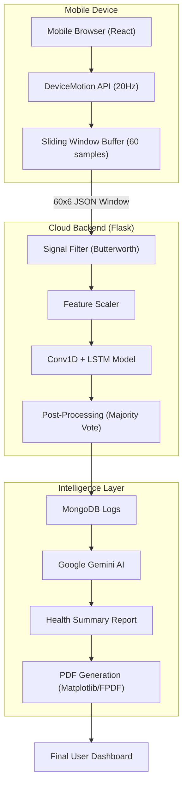

# 🦾 Human Activity Recognition (HAR) Engine
### **Real-Time Motion Intelligence with Hybrid Deep Learning & AI Health Reporting**


---

## 🌟 Overview

The **HAR Engine** is a production-grade Human Activity Recognition system that transforms raw smartphone sensor data into actionable health insights. By leveraging a custom-trained **Conv1D + LSTM** hybrid model, the system classifies 8 distinct physical activities in real-time with **83% accuracy**.

Unlike traditional HAR systems, this project provides a complete end-to-end ecosystem: from live mobile sensor streaming to **AI-generated clinical health reports** powered by Google Gemini, securely stored in MongoDB, and shareable with healthcare providers.

---

## 🚀 The Full Walkthrough

### **Phase 1: Real-Time Data Acquisition**
The journey begins on the **React-based Mobile Dashboard**. 
1. **Sensor Streaming**: Using the W3C DeviceMotion API, the mobile browser captures 6-axis data (Accelerometer + Gyroscope) at **20Hz**.
2. **Dynamic Windowing**: Samples are buffered into **3-second sliding windows** (60 samples each).
3. **Cross-Origin Security**: The frontend is isolated using COOP/COEP headers to allow secure **Google OAuth 2.0** authentication even on mobile browsers.

### **Phase 2: The ML "Brain" (Conv1D + LSTM)**
When a data window reaches the **Flask Backend**, it undergoes a rigorous processing pipeline:
1. **Signal Preprocessing**: 
   - **Butterworth Filtering**: Removes high-frequency noise and separates gravity from body acceleration.
   - **Feature Engineering**: Calculates Euclidean magnitudes for rotation-invariant motion intensity.
2. **Hybrid Inference**: 
   - **Conv1D Layers**: Extract spatial features across the 6 sensor channels.
   - **LSTM Layers**: Model temporal dependencies, learning the "rhythm" of activities like walking vs. jogging.
3. **Smoothing & Confidence**: A **Majority Voting** algorithm and **Confidence Thresholding** ensure the UI remains stable and doesn't flicker between classes.

### **Phase 3: AI Insights & Clinical Reporting**
The system doesn't just label activities—it understands your day.
1. **Activity Logging**: Every verified movement is logged to **MongoDB Atlas**.
2. **Gemini AI Analysis**: At the end of the day, the system aggregates your logs (total calories, active minutes, intensity) and feeds them to **Google Gemini 1.5 Flash**.
3. **Professional Reports**: The AI generates a supportive, clinical summary of your health trends, which can be:
   - Viewed on the web dashboard.
   - **Shared** with a doctor or trainer via email.
   - Exported as a **Professional PDF** with Matplotlib-generated activity distribution charts.

---

## 🛠️ Technical Stack

| Layer | Technologies |
| :--- | :--- |
| **Frontend** | React 19, Vite, Chart.js, Framer Motion, Lucide, Google OAuth |
| **Backend** | Flask (Python), Keras (TensorFlow), SciPy, JWT, PyMongo |
| **Database** | MongoDB Atlas (Cloud NoSQL) |
| **AI/ML** | Google Gemini 1.5 Flash, 1D-CNN + LSTM Hybrid Model |
| **DevOps** | Vercel (Frontend), Local/LAN Hosting (Mobile testing) |

---

## 🏗️ Project Architecture



---

## 📊 Model Performance

The model was trained on a **massively augmented (30x)** dataset combining WISDM, Heterogeneity Activity Recognition, UCI HAR, and custom-recorded user data.

- **Global Accuracy**: 82.99%
- **Jogging Precision**: 99%
- **Eating Precision**: 96%
- **Still Precision**: 94%

By prioritizing custom real-world data over laboratory datasets, the model handles the noise and variability of daily life far better than standard benchmark models.

---

## 🚀 Getting Started

### **1. Clone & Install**
```bash
git clone https://github.com/your-username/Minor_HAR.git
cd Minor_HAR
```

### **2. Backend Setup**
```bash
cd backend
pip install -r requirements.txt
# Add MONGODB_URI, GEMINI_API_KEY, and VITE_GOOGLE_CLIENT_ID to .env
python app.py
```

### **3. Frontend Setup**
```bash
cd frontend
npm install
npm run dev -- --host
```

### **4. Mobile Connection**
1. Ensure your phone and PC are on the same WiFi.
2. Open the **Network URL** shown in the Vite terminal on your phone.
3. Sign in, grant sensor permissions, and start moving!

---

## 👨‍💻 Contributors

- **Vansh Tambi** ([vanshtambi@gmail.com](mailto:vanshtambi@gmail.com))
- **Vivek Pasi** ([vivekpasi43@gmail.com](mailto:vivekpasi43@gmail.com))

---
*Developed as part of the Minor Project at IIIT Bhopal, 2026.*
