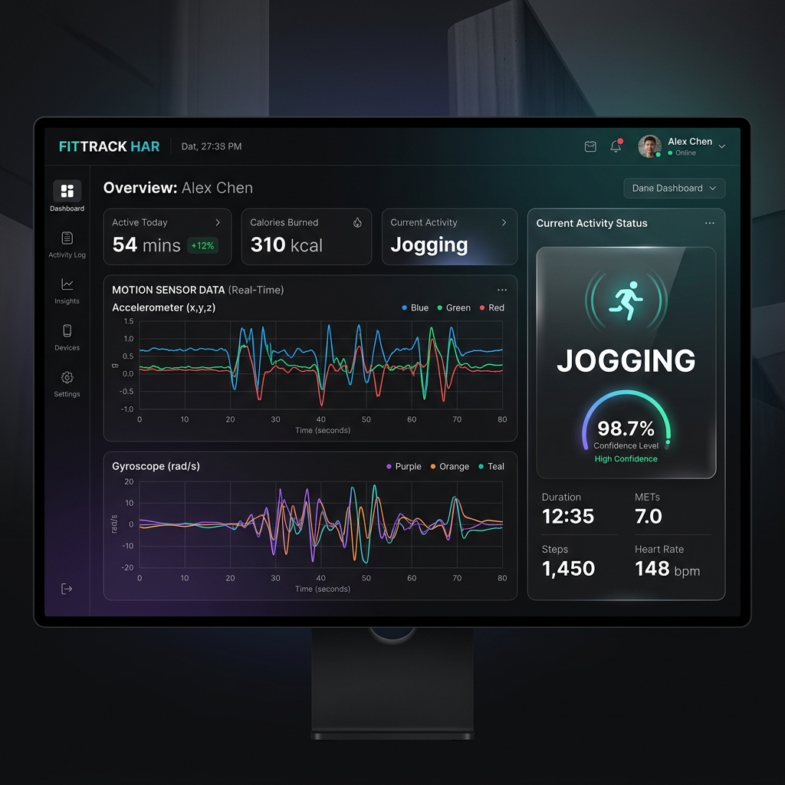

# Minor HAR

Real-time Human Activity Recognition (HAR) system with:

- Mobile sensor capture (accelerometer + gyroscope) from browser
- Hybrid deep learning inference (Conv1D + LSTM)
- JWT-based authenticated reporting workflow
- AI-generated daily health summaries (Gemini)
- Report sharing and PDF export



## What This Project Does

This project is an end-to-end HAR pipeline split into three parts:

1. Frontend (React + Vite): captures sensor data at 20 Hz, buffers 60 samples (3 seconds), and sends windows to the backend.
2. Backend (Flask): preprocesses sensor windows, performs model inference, smooths predictions, stores activity logs, and generates reports.
3. Training/Data Pipeline (Python): prepares datasets from multiple sources, augments custom recordings, trains a Conv1D+LSTM model, and exports model artifacts.

## Implemented Activity Classes

The deployed model is trained for 7 core classes:

- Walking
- Jogging
- Stairs
- Still
- Hand Activity
- Sports

At inference time, a runtime class `Uncertain` is used when confidence is below threshold.

## Tech Stack

- Frontend: React 19, Vite, Axios, Chart.js, Framer Motion, Lucide
- Backend: Flask, Flask-CORS, PyJWT, PyMongo, google-auth
- ML/Signal Processing: TensorFlow/Keras, NumPy, SciPy, scikit-learn, pandas
- Reporting: Google Gemini API, matplotlib, fpdf2
- Database: MongoDB Atlas (or local MongoDB)

## Project Structure

```text
Minor_HAR/
|- backend/
|  |- app.py                  # Flask API (auth, predict, reports, PDF)
|  |- train_model.py          # Model training script
|  |- requirements.txt
|  |- har_model.keras         # Current deployed model artifact
|  |- scaler.pkl
|  |- label_encoder.pkl
|  |- activity_names.pkl
|  |- report.txt              # Latest training metrics artifact
|  `- backup_model/
|- frontend/
|  |- src/
|  |  |- App.jsx
|  |  |- hooks/useAccelerometer.js
|  |  `- components/
|  |- package.json
|  `- vite.config.js
|- prepare_data.py            # Dataset extraction + preprocessing + augmentation
|- download_wisdm.py          # WISDM download utility
|- X_all.npy / y_all.npy      # Prepared training arrays
|- docs/images/dashboard_preview.png
`- README.md
```

## Data and Model Pipeline

### 1) Dataset Preparation

`prepare_data.py` combines and standardizes data from:

- WISDM
- Heterogeneity Activity Recognition
- UCI HAR
- Custom mobile recordings (`*.csv` at repository root)

Key preprocessing steps:

- Butterworth low-pass filtering
- Gravity/body acceleration separation
- Magnitude features (`accel_mag`, `gyro_mag`) to form 8 channels
- Sliding windows of 60 with step size 30
- Heavy augmentation for custom recordings (jitter, scaling, time shift, warp, permutation, inversion)

### 2) Model Training

`backend/train_model.py`:

- Loads `X_all.npy` and `y_all.npy`
- Applies global feature scaling
- Trains Conv1D + LSTM model with class weights
- Saves artifacts to `backend/`

Saved artifacts:

- `backend/har_model.keras`
- `backend/scaler.pkl`
- `backend/label_encoder.pkl`
- `backend/activity_names.pkl`
- `backend/confusion_matrix.png`
- `backend/report.txt`

### 3) Runtime Inference

`backend/app.py`:

- Accepts 60x6 window on `POST /predict`
- Converts to 60x8 engineered feature window
- Applies scaler + model prediction
- Applies confidence threshold and short majority voting smoothing

## API Overview

- `GET /` : health/status response
- `POST /api/auth/google` : Google login exchange -> JWT
- `POST /predict` : HAR inference endpoint
- `POST /api/reports/generate` : generate daily AI report (auth required)
- `GET /api/reports` : fetch own/shared reports (auth required)
- `POST /api/reports/share` : share report by email (auth required)
- `GET /api/reports/<report_id>/pdf` : export report PDF (auth required)

Authorization format:

```http
Authorization: Bearer <jwt_token>
```

## Quick Start

### Prerequisites

- Python 3.11+
- Node.js 18+
- npm
- MongoDB (Atlas or local)

### 1) Clone

```bash
git clone https://github.com/vansh-tambi/Minor_HAR.git
cd Minor_HAR
```

### 2) Backend Setup

```bash
cd backend
python -m venv .venv
# Windows PowerShell
.\.venv\Scripts\Activate.ps1
pip install -r requirements.txt
```

Create `backend/.env`:

```env
PORT=5000
DEBUG=True
MONGODB_URI=<your_mongodb_uri>
VITE_GOOGLE_CLIENT_ID=<your_google_client_id>
JWT_SECRET=<your_jwt_secret>
GEMINI_API_KEY=<your_gemini_api_key>
```

Run backend:

```bash
python app.py
```

### 3) Frontend Setup

Open a new terminal:

```bash
cd frontend
npm install
```

Create `frontend/.env`:

```env
VITE_API_BASE_URL=http://localhost:5000
VITE_GOOGLE_CLIENT_ID=<your_google_client_id>
```

Run frontend:

```bash
npm run dev
```

### 4) Mobile Testing

- Keep phone and development machine on the same network.
- Open the Vite LAN URL on your phone.
- Start capture from dashboard.

## Training Workflow (Optional)

From repository root:

```bash
python prepare_data.py
python backend/train_model.py
```

This regenerates `X_all.npy`, `y_all.npy`, and backend model artifacts.

## Current Notes

- `backend/report.txt` currently reflects the latest checked-in training metrics artifact.
- Some large model/data artifacts are intentionally versioned for direct local inference.
- The generated repository reports (`report_part1.md` to `report_part4.md`, `Minor_Project_Report_COMPLETE.md`) document academic project details.

## Security Note

Do not commit real credentials in `.env` files. If secrets were previously committed, rotate them immediately and replace with environment-managed secrets.

## Contributors

- Vansh Tambi
- Vivek Pasi
