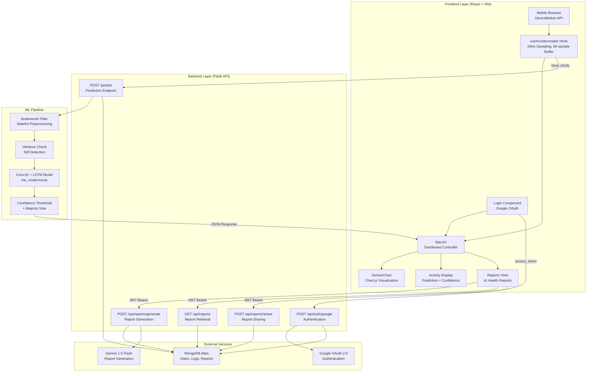
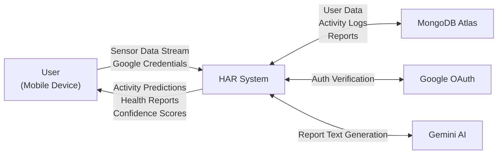
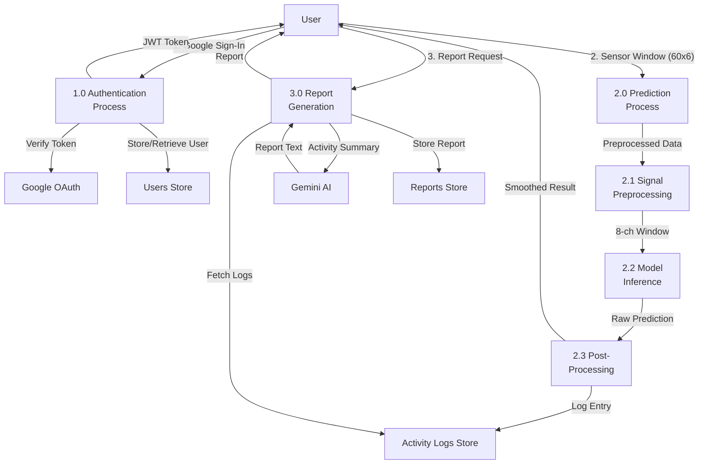
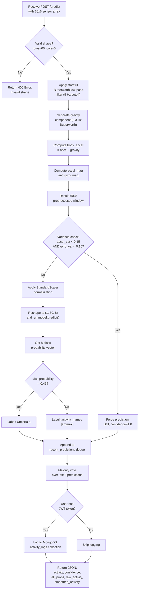
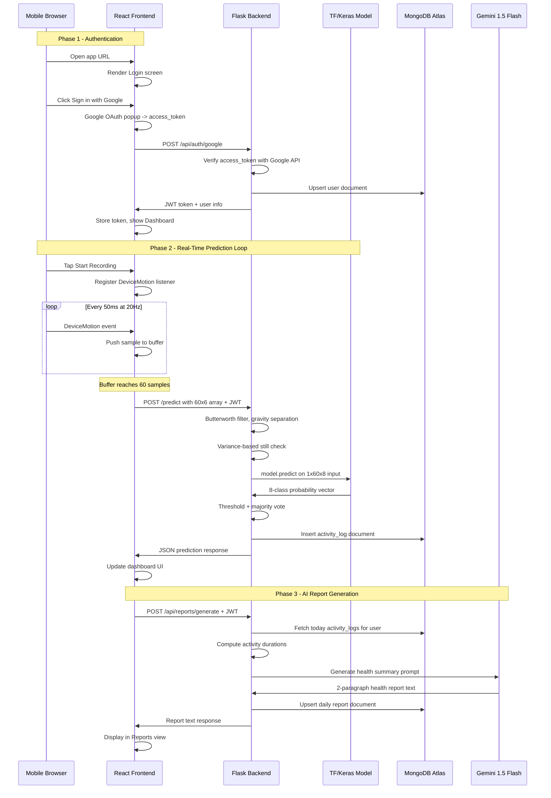
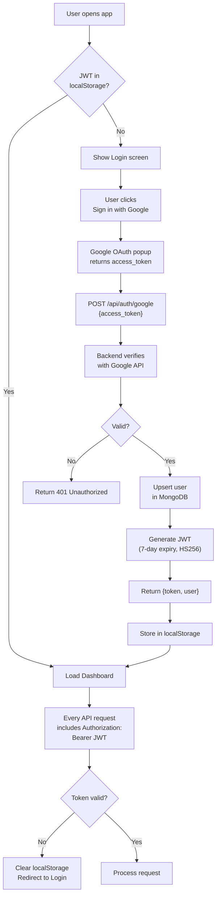

## CHAPTER 4: PROPOSED METHODOLOGY AND WORK DESCRIPTION

### 4.1 System Overview

The proposed system follows a client-server architecture comprising four principal subsystems: (a) a mobile sensor data acquisition layer, (b) a deep learning inference engine, (c) a persistent data management layer, and (d) an AI-powered reporting module. The mobile browser captures raw accelerometer and gyroscope data using the W3C DeviceMotion API, buffers sixty samples at 20 Hz to form three-second sliding windows, and transmits each window as a JSON payload to the Flask backend via HTTP POST requests. The backend applies real-time signal preprocessing, invokes the trained Conv1D + LSTM model for inference, logs predictions to MongoDB, and returns classification results to the frontend for live visualization.

### 4.2 Data Collection and Dataset Aggregation

The training data is assembled from four sources, each contributing unique characteristics to the overall dataset.

**Table 4.1: Dataset Sources and Contributions**

| Dataset | Source | Sensor Modalities | Raw Activities | Samples Used |
|---------|--------|-------------------|---------------|-------------|
| WISDM | UCI Archive | Phone Accel + Gyro | 18 coded (A-S) | Capped 500/class |
| Heterogeneity | UCI Archive | Phone Accel + Gyro | 6 activities | Capped 500/class |
| UCI HAR | UCI Archive | Body Accel + Gyro | 6 activities (1-6) | Capped 500/class |
| Custom CSV | User-recorded | Phone Accel + Gyro | 3 activities | Uncapped, 30x augmented |

The WISDM dataset provides accelerometer and gyroscope readings from smartphone sensors carried by subjects performing eighteen activities including walking, jogging, stairs, sitting, standing (various types), and sports activities. Each record contains a subject identifier, activity code, timestamp, and tri-axial sensor values. The data is stored in semicolon-delimited text files requiring custom parsing logic to handle malformed entries and missing values.

The Heterogeneity Activity Recognition dataset addresses device heterogeneity by collecting data from multiple smartphone models. It contains accelerometer and gyroscope readings for six activities: walk, sit, stand, stairs up, stairs down, and bike. The data is distributed as a ZIP archive containing CSV files with columns for timestamp, user, device model, sensor values, and ground truth labels. Due to its large size, aggressive subsampling (every tenth row) is applied during extraction to manage memory constraints.

The UCI HAR dataset provides pre-segmented windows of 128 samples from body-mounted accelerometers and gyroscopes during six activities. Since the window length differs from the project's standard of sixty samples, bilinear interpolation via scipy.ndimage.zoom is applied to resample each 128-sample window to sixty samples while preserving the signal morphology.

Custom mobile sensor data was recorded by the project team using a smartphone sensor logging application. Three CSV files were recorded for Still, Jogging, and activities, each containing timestamped accelerometer (sensor type 1) and gyroscope (sensor type 4) readings. The custom data undergoes timestamp-based alignment using pandas merge_asof with nearest-neighbor matching and a tolerance of 500 milliseconds.

### 4.3 Activity Class Consolidation

The heterogeneous activity taxonomies across datasets are unified into eight consolidated classes through a carefully designed mapping.

**Table 4.2: Activity Class Consolidation Mapping**

| Unified Class | WISDM Codes | Heterogeneity Labels | UCI HAR Labels |
|--------------|-------------|---------------------|---------------|
| Walking | A | walk | 1 |
| Jogging | B | — | — |
| Stairs | C | stairsup, stairsdown | 2, 3 |
| Still | D, E | sit, stand | 4, 5, 6 |
| | H, I, J, K, L | — | — |
| Hand Activity | F, G, Q | — | — |
| Active Hands | R, S | — | — |
| Sports | M, O, P | bike | — |

This consolidation groups semantically similar activities to reduce class fragmentation and improve model stability. For example, WISDM codes D (sitting) and E (standing) are merged into "Still" since both represent stationary postures with minimal sensor variance. Multiple sub-activities (drinking soup sandwich chips pasta) are consolidated into a single "" class to provide sufficient training samples for this complex activity category.

### 4.4 Signal Preprocessing Pipeline

Each raw sensor window undergoes a multi-stage preprocessing pipeline that transforms the six-channel input (accelerometer XYZ, gyroscope XYZ) into an eight-channel representation optimized for deep learning classification.

**Stage 1: Noise Reduction.**
A third-order Butterworth low-pass filter with a cutoff frequency of 5 Hz (relative to the 20 Hz sampling rate) is applied independently to each of the six sensor channels. This filter attenuates high-frequency noise introduced by sensor quantization, mechanical vibrations, and electromagnetic interference while preserving the low-frequency motion components that encode activity information. The filter is designed using scipy.signal.butter with second-order sections (SOS) representation for numerical stability.

**Stage 2: Gravity Separation.**
A second third-order Butterworth low-pass filter with a much lower cutoff frequency of 0.3 Hz is applied to the three accelerometer channels to isolate the gravitational component. Since gravity manifests as a quasi-static acceleration vector aligned with the Earth's gravitational field, it occupies the lowest frequency band of the accelerometer signal. The body acceleration component is obtained by subtracting the estimated gravity from the filtered accelerometer signal: body_accel = filtered_accel - gravity.

**Stage 3: Magnitude Feature Engineering.**
Two additional channels are computed: the Euclidean magnitude of the body acceleration vector (accel_mag = sqrt(bx^2 + by^2 + bz^2)) and the Euclidean magnitude of the gyroscope vector (gyro_mag = sqrt(gx^2 + gy^2 + gz^2)). These magnitude features provide rotation-invariant representations of motion intensity that are independent of the device's spatial orientation relative to the user's body.

**Stage 4: Output.**
The final preprocessed window has shape (60, 8) with channels: [body_accel_x, body_accel_y, body_accel_z, gyro_x, gyro_y, gyro_z, accel_magnitude, gyro_magnitude].

### 4.5 Data Augmentation Strategy

Custom-recorded data receives thirty-fold augmentation using six complementary techniques applied in combination to each original window:

**Table 4.3: Augmentation Techniques Applied to Custom Data**

| Technique | Description | Parameters | Application Frequency |
|-----------|-------------|------------|----------------------|
| Gaussian Jitter | Additive white Gaussian noise | sigma in [0.01, 0.05] | Every sample |
| Magnitude Scaling | Multiplicative scaling factor | scale in [0.90, 1.10] | Every sample |
| Temporal Shifting | Circular shift along time axis | shift in [0, 8] samples | Every sample |
| Time Warping | Non-uniform temporal distortion | warp in [0.8, 1.2] | Every 3rd sample |
| Channel Permutation | Random reordering of axis channels | Random permutation of 3 axes | Every 5th sample |
| Signal Inversion | Sign reversal on random channel | Single channel negated | Every 4th sample |

The augmentation pipeline produces diverse training examples that simulate natural variations in sensor readings caused by differences in device placement, user biomechanics, and environmental conditions. The combination of multiple techniques ensures that the model learns features invariant to these sources of variability rather than overfitting to the specific characteristics of the recorded data.

Public dataset contributions are capped at five hundred windows per class using random sampling. This cap prevents large public datasets from dominating the training distribution and ensures that the model's learned representations are biased toward the custom data's sensor characteristics, which more closely match the deployment environment.

### 4.6 Model Architecture

The classification model employs a sequential hybrid architecture consisting of two convolutional feature extraction blocks, two LSTM temporal modeling layers, and a fully connected classifier head.

**Feature Extraction Block 1:**
- Conv1D with 64 filters, kernel size 5, ReLU activation, same padding, L2 regularization (lambda = 1e-4)
- Batch Normalization
- Conv1D with 64 filters, kernel size 3, ReLU activation, same padding, L2 regularization
- Batch Normalization
- MaxPooling1D with pool size 2 (reduces temporal dimension from 60 to 30)
- Dropout with rate 0.2

The first block employs a larger initial kernel (size 5) to capture broader temporal patterns spanning 250 milliseconds of sensor data, followed by a smaller kernel (size 3) for fine-grained refinement. Batch normalization stabilizes training by normalizing intermediate activations, while max-pooling reduces the temporal resolution and introduces translational invariance.

**Feature Extraction Block 2:**
- Conv1D with 128 filters, kernel size 3, ReLU activation, same padding, L2 regularization
- Batch Normalization
- Conv1D with 128 filters, kernel size 3, ReLU activation, same padding, L2 regularization
- Batch Normalization
- MaxPooling1D with pool size 2 (reduces temporal dimension from 30 to 15)
- Dropout with rate 0.3

The second block doubles the filter count to learn richer, more abstract feature representations at the reduced temporal resolution. The increased dropout rate mitigates overfitting as the network depth increases.

**Temporal Modeling:**
- LSTM with 128 units, return_sequences=True, L2 regularization
- Dropout with rate 0.3
- LSTM with 64 units, return_sequences=False, L2 regularization
- Dropout with rate 0.4

The first LSTM processes the sequence of convolutional feature vectors (15 time steps of 128-dimensional features) and outputs a sequence of hidden states, capturing temporal dependencies across the reduced window. The second LSTM condenses this sequence into a single fixed-dimensional vector representing the temporal summary of the entire window. The stacked LSTM configuration enables hierarchical temporal abstraction.

**Classifier Head:**
- Dense with 128 units, ReLU activation, L2 regularization
- Batch Normalization, Dropout 0.4
- Dense with 64 units, ReLU activation, L2 regularization
- Batch Normalization, Dropout 0.3
- Dense with 8 units, Softmax activation (output layer)

The classifier maps the LSTM output to an eight-dimensional probability distribution over activity classes using the softmax activation function. Progressive dimensionality reduction (128 → 64 → 8) with dropout prevents overfitting in the classification layers.

### 4.7 Training Configuration

The model is trained using the following configuration:

- **Optimizer:** Adam with initial learning rate 0.001
- **Loss Function:** Sparse categorical cross-entropy
- **Batch Size:** 64
- **Maximum Epochs:** 60
- **Early Stopping:** Monitors validation accuracy with patience of 10 epochs, restores best weights
- **Learning Rate Scheduling:** ReduceLROnPlateau monitors validation loss, reduces by factor 0.5 with patience 3, minimum 1e-6
- **Class Weighting:** Computed using sklearn's compute_class_weight with 'balanced' strategy to compensate for class imbalance
- **Data Split:** 80 percent training, 20 percent testing, stratified by class label

Input data is normalized using sklearn's StandardScaler fitted on the flattened training data. The scaler parameters are persisted as a pickle file for consistent normalization during inference.

### 4.8 Real-Time Inference Pipeline

The inference pipeline incorporates multiple stages of intelligence beyond raw model prediction:

1. **Stateful Butterworth Filtering:** Unlike training-time preprocessing which uses zero-phase bidirectional filtering (sosfiltfilt), real-time inference uses causal filtering (sosfilt) with persistent filter states maintained across consecutive prediction requests. This ensures smooth, continuous filtering of the streaming sensor data without introducing look-ahead artifacts.

2. **Variance-Based Stationary Detection:** Before invoking the neural network, the system computes the sum of per-axis variances for both accelerometer and gyroscope channels. If both variances fall below 0.15, the system bypasses model inference entirely and returns "Still" with 100 percent confidence. This heuristic eliminates false positive activity classifications when the device is placed on a stationary surface.

3. **StandardScaler Normalization:** The preprocessed eight-channel window is normalized using the training-time scaler to ensure consistent input distributions.

4. **Model Inference:** The normalized window is reshaped to (1, 60, 8) and passed through the Keras model to obtain an eight-dimensional probability vector.

5. **Confidence Thresholding:** If the maximum class probability falls below 0.45, the prediction is labeled as "Uncertain" rather than committing to a potentially incorrect classification.

6. **Majority Voting:** A sliding window of the three most recent predictions is maintained, and the final output is determined by majority vote to smooth temporal fluctuations in predictions.

### 4.9 Authentication and Data Persistence

User authentication employs the OAuth 2.0 implicit grant flow via Google's authentication service. The frontend uses the @react-oauth/google library to initiate the Google Sign-In flow, obtaining an access token upon successful authentication. This access token is transmitted to the backend, which verifies it by querying Google's userinfo endpoint (googleapis.com/oauth2/v3/userinfo) to retrieve the user's email address and display name.

Upon successful verification, the backend creates or retrieves the user record in MongoDB and issues a JSON Web Token (JWT) with a seven-day expiry, signed using the HS256 algorithm with a server-side secret. Subsequent API requests include this JWT in the Authorization header as a Bearer token, enabling stateless session management.

Activity predictions made by authenticated users are logged to MongoDB's activity_logs collection with fields for user_id, timestamp, activity label, and confidence score. This accumulated data serves as the input for AI-powered health report generation.

### 4.10 AI-Powered Health Reporting

The health reporting module aggregates a user's daily activity logs, computes activity durations (estimated as prediction count multiplied by three seconds per window), and constructs a structured prompt for Google's Gemini 1.5 Flash model. The prompt instructs the LLM to generate a professional, encouraging, two-paragraph daily health report summarizing the user's movement patterns without exposing raw numerical data.

Generated reports are stored in MongoDB's reports collection with one report per user per day (upsert semantics). Users can share reports with other registered users by email, enabling collaborative health monitoring scenarios such as caregiver-patient or coach-athlete relationships.

---

## CHAPTER 5: PROPOSED ALGORITHMS

### 5.1 Algorithm 1: Data Preparation Pipeline

```
ALGORITHM: Prepare_HAR_Training_Data

INPUT: Custom CSV files, WISDM dataset, Heterogeneity dataset, UCI HAR dataset
OUTPUT: X_all.npy (N x 60 x 8), y_all.npy (N,)

BEGIN
    DEFINE WINDOW_SIZE = 60, STEP_SIZE = 30, CHANNELS = 8
    DEFINE ACTIVITY_MERGE mapping for all datasets
    INITIALIZE frames = [], labels = []

    // Phase 1: Extract and augment custom data (highest priority)
    FOR EACH (csv_file, activity_label) IN custom_files:
        df = READ csv_file
        accel = FILTER rows WHERE sensor_type == 1
        gyro = FILTER rows WHERE sensor_type == 4
        merged = MERGE_ASOF(accel, gyro, on='Timestamp', tolerance=500ms)
        data_6ch = merged[ax, ay, az, gx, gy, gz]

        FOR i = 0 TO len(data_6ch) - WINDOW_SIZE STEP STEP_SIZE:
            window = data_6ch[i : i + WINDOW_SIZE]
            processed = PREPROCESS_WINDOW(window)  // 6ch -> 8ch
            frames.APPEND(processed)
            labels.APPEND(activity_label)
        END FOR

        // 30x augmentation on custom data
        aug_frames = AUGMENT(frames_from_this_file, num_augments=30)
        frames.EXTEND(aug_frames)
    END FOR

    // Phase 2-4: Extract public datasets (capped at 500/class)
    FOR EACH dataset IN [UCI_HAR, Heterogeneity, WISDM]:
        ds_frames, ds_labels = EXTRACT(dataset)
        ds_frames, ds_labels = CAP_PER_CLASS(ds_frames, ds_labels, max=500)
        frames.EXTEND(ds_frames)
        labels.EXTEND(ds_labels)
    END FOR

    X_all = NUMPY_ARRAY(frames)
    y_all = NUMPY_ARRAY(labels)
    SAVE(X_all, "X_all.npy")
    SAVE(y_all, "y_all.npy")
END

FUNCTION PREPROCESS_WINDOW(window_6d):
    // window_6d shape: (N, 6)
    filtered = BUTTERWORTH_LOWPASS(window_6d, cutoff=5Hz, order=3)
    accel = filtered[:, 0:3]
    gyro = filtered[:, 3:6]
    gravity = BUTTERWORTH_LOWPASS(accel, cutoff=0.3Hz, order=3)
    body_accel = accel - gravity
    accel_mag = NORM(body_accel, axis=1)
    gyro_mag = NORM(gyro, axis=1)
    RETURN CONCATENATE(body_accel, gyro, accel_mag, gyro_mag)
    // Output shape: (N, 8)
END FUNCTION
```

**Figure 6.1: Pseudocode for Data Preparation Algorithm**

### 5.2 Algorithm 2: Real-Time Prediction

```
ALGORITHM: Real_Time_HAR_Prediction

INPUT: sensor_window (60 x 6 raw sensor data), filter_states, recent_predictions
OUTPUT: smoothed_activity, confidence, probability_vector

BEGIN
    // Step 1: Validate input
    IF shape(sensor_window) != (60, 6):
        RETURN ERROR "Invalid input shape"

    // Step 2: Real-time preprocessing (causal filtering)
    FOR i = 0 TO 5:
        filtered[:, i], filter_states[i] = SOSFILT(sos_noise, sensor_window[:, i], zi=filter_states[i])
    END FOR
    accel = filtered[:, 0:3]
    gyro = filtered[:, 3:6]

    FOR i = 0 TO 2:
        gravity[:, i], gravity_states[i] = SOSFILT(sos_gravity, accel[:, i], zi=gravity_states[i])
    END FOR
    body_accel = accel - gravity
    accel_mag = NORM(body_accel, axis=1)
    gyro_mag = NORM(gyro, axis=1)
    processed = CONCATENATE(body_accel, gyro, accel_mag, gyro_mag)  // (60, 8)

    // Step 3: Stationary detection (bypass model)
    accel_variance = SUM(VARIANCE(sensor_window[:, 0:3], axis=0))
    gyro_variance = SUM(VARIANCE(sensor_window[:, 3:6], axis=0))
    IF accel_variance < 0.15 AND gyro_variance < 0.15:
        RETURN ("Still", 1.0, [0,...,1,...,0])

    // Step 4: Normalize and predict
    processed_scaled = SCALER.TRANSFORM(processed)
    X = RESHAPE(processed_scaled, (1, 60, 8))
    probabilities = MODEL.PREDICT(X)
    pred_index = ARGMAX(probabilities)
    confidence = probabilities[pred_index]
    activity = ACTIVITY_NAMES[pred_index]

    // Step 5: Confidence thresholding
    IF confidence < 0.45:
        activity = "Uncertain"

    // Step 6: Majority voting (temporal smoothing)
    recent_predictions.APPEND(activity)
    smoothed_activity = MODE(recent_predictions, last_3)

    RETURN (smoothed_activity, confidence, probabilities)
END
```

**Figure 6.2: Pseudocode for Real-Time Prediction Algorithm**

---

## CHAPTER 6: PROPOSED FLOWCHARTS AND DIAGRAMS

### 6.1 System Architecture Diagram

**Figure 3.1: High-Level System Architecture**



### 6.2 Data Flow Diagram (Level 0)

**Figure 3.2: Context-Level Data Flow Diagram**



### 6.3 Data Flow Diagram (Level 1)

**Figure 3.3: Detailed Data Flow Diagram**



### 6.4 Prediction Pipeline Flowchart

**Figure 5.3: Prediction Pipeline Flowchart**



### 6.5 End-to-End Sequence Diagram

**Figure 5.4: End-to-End System Sequence Diagram**



### 6.6 Authentication Flow Diagram

**Figure 5.5: Authentication and Session Flow**


