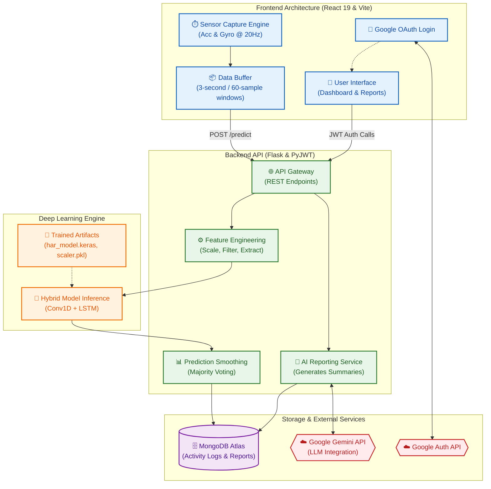
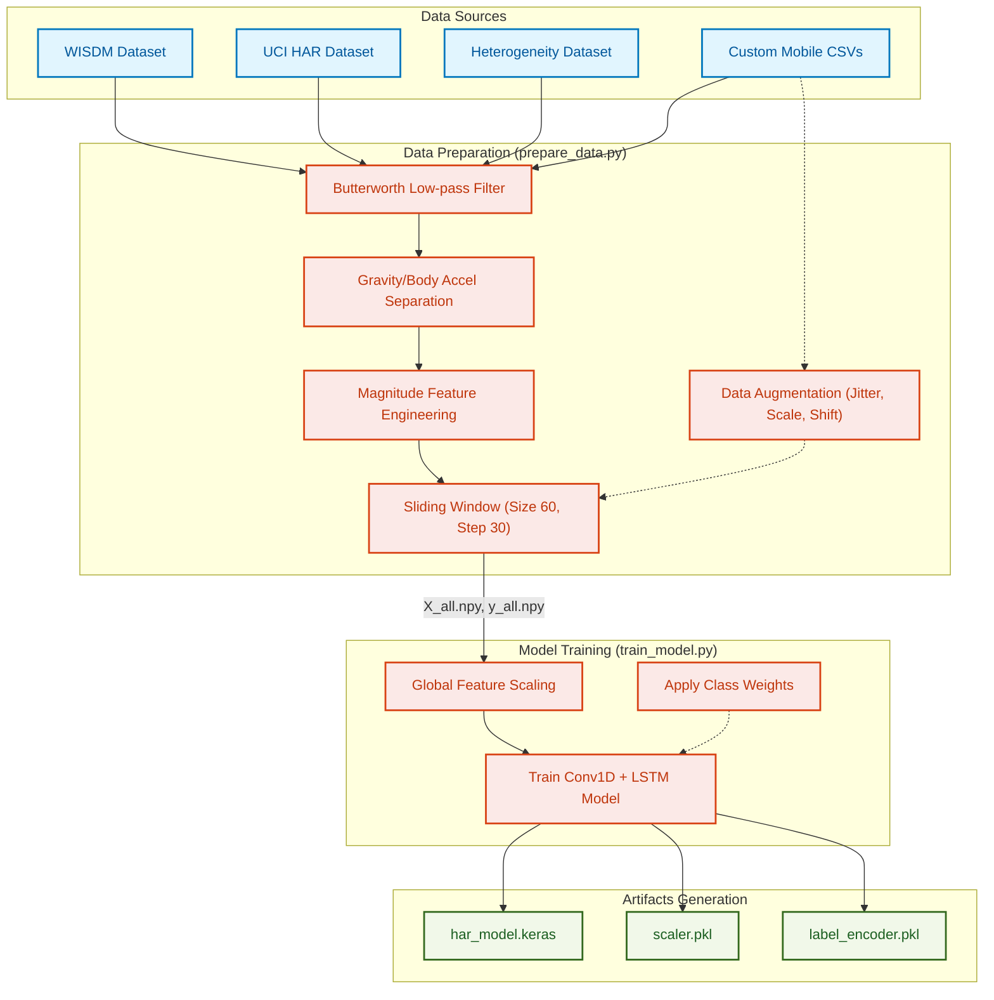

# Minor HAR - System Architecture

> Visual overview of system components, data flow, and training pipelines.

## System Architecture

The following diagram illustrates the real-time operational flow of the system. It showcases how sensor data is captured on the frontend, processed through the Flask backend, passed into the hybrid deep learning engine, and finally stored and utilized for AI-generated health reporting.

## Data & Training Pipeline

The offline training pipeline is responsible for merging multiple academic datasets with custom mobile recordings, engineering magnitude features, applying heavy data augmentation, and training the optimal `Conv1D + LSTM` topology.

---

## Implementation

> Tools, technologies, and development details

### Tech Stack

| Category | Technologies Used | Details |
| :--- | :--- | :--- |
| **Frontend Language** | JavaScript, JSX, HTML5, CSS3 | Used for the web application UI and mobile browser sensor capture via Web APIs. |
| **Frontend Framework** | React 19, Vite | Fast, modern client-side framework with component-driven architecture. |
| **Backend Language** | Python 3.11+ | Primary language for API routing, data processing, and ML training pipelines. |
| **Backend Framework** | Flask, Flask-CORS | Lightweight Python microframework serving the REST API and prediction endpoints. |
| **Machine Learning** | TensorFlow / Keras, Scikit-learn | Used for defining, training, and running inference on the Conv1D + LSTM model. |
| **Data Processing** | NumPy, SciPy, Pandas | Used heavily in the data preparation and runtime feature engineering. |
| **Database** | MongoDB Atlas (PyMongo) | NoSQL document database used to store daily activity logs and health reports. |
| **Authentication** | Google OAuth, PyJWT | Secure user login workflow exchanging Google tokens for signed JWTs. |
| **External APIs** | Google Gemini API | Powers the automated AI-generated daily health summary reports. |
| **Visualizations** | Chart.js, Framer Motion | Interactive timeline graphs and smooth UI animations on the React client. |

### Core Project Flow

1. **Capture**: The React frontend (`useAccelerometer.js`) hooks into the device's accelerometer and gyroscope, sampling at exactly **20 Hz**.
2. **Buffer**: It buffers these readings until it reaches **60 samples (3 seconds)**.
3. **Transmit**: The 60-sample window is sent over HTTP to the Flask `POST /predict` API.
4. **Engineer**: Flask passes the data through `SciPy` Butterworth filters, computes magnitudes, and shapes it into an `(1, 60, 8)` tensor.
5. **Infer**: The pre-trained Keras model predicts the activity out of 7 possible classes (Walking, Jogging, Stairs, Still, Eating, Hand Activity, Sports).
6. **Smooth**: A sliding window majority-vote mechanism prevents erratic UI flickering.
7. **Store & Analyze**: The final predictions are saved to MongoDB. Once a day, the Gemini API is called to summarize the day's activity timeline into a human-readable health report.
